# Diseño de PostgreSQL

> **Arquitectura de datos v0.1 aprobada — DDL v0.1 creado y no ejecutado**

Este documento fija la arquitectura de datos v0.1 aprobada. El borrador transaccional se encuentra
en `db/migrations/0001_initial_schema.sql`, acompañado por `MIGRATION_STRATEGY.md` y
`DDL_REVIEW.md`. El SQL no ha sido ejecutado: PostgreSQL continúa sin instalar, no existe ninguna
tabla real y el importador tampoco está implementado. El siguiente paso es revisar el DDL y solo
después preparar el entorno PostgreSQL local.

## 1. Alcance y evidencia disponible

La propuesta parte de:

- Odoo como fuente maestra;
- la exportación `product.template` de NATSUKI / empaques documentada en `DATA_SPEC.md`;
- 893 filas, 13 columnas y 893 referencias internas únicas en la muestra actual;
- ausencia de ID estable de Odoo, ID externo y registros individuales de `product.product`;
- nombres duplicados, cantidades con signo e imágenes opcionales;
- arquitectura oficial PostgreSQL + FastAPI + Jinja2/HTML/CSS/JavaScript.

Los nombres y tipos lógicos siguientes se mapearon al DDL v0.1 y permanecen sujetos a revisión
antes de ejecutar el archivo en PostgreSQL.

## 2. Objetivos y principios

1. **PostgreSQL es la base oficial.** SQLite no se considera base principal.
2. **Odoo es la fuente maestra.** El catálogo no debe sustituir ni reescribir el origen.
3. **Trazabilidad completa.** Todo dato normalizado debe apuntar a su importación, archivo y fila.
4. **Staging inmutable.** Las filas originales no se corrigen ni se reemplazan.
5. **Conservación del dato original.** Normalización y extracción se almacenan por separado.
6. **Cero eliminaciones automáticas.** Los cambios de vigencia son explícitos y auditables.
7. **Múltiples marcas y familias.** Marca y categoría son dimensiones, no constantes globales.
8. **Variantes futuras.** No se inventan variantes; se prepara su incorporación cuando Odoo las exporte.
9. **Historial de inventario.** Las cantidades se agregan como fotografías, nunca se sobrescriben.
10. **Publicaciones reproducibles.** Una versión publicada conserva exactamente sus productos y datos.
11. **Reconstrucción.** Staging, candidatos, snapshots y auditoría permiten reconstruir cada resultado.
12. **Fallos parciales visibles.** Una imagen o fecha inválida genera una incidencia, no la pérdida del producto.
13. **Planes exactos antes de aplicar.** Todo modo genera un plan persistido; solo se aplica el plan
    explícitamente aprobado y ligado al archivo, contrato y reglas exactos.
14. **Estado activo desconocido.** La presencia o ausencia en una exportación nunca decide la vigencia.

## 3. Convenciones propuestas

- Claves internas: `uuid`, generadas independientemente de Odoo.
- Fechas del sistema: `timestamptz` normalizado a UTC; se conservan valor y zona originales.
- Texto normalizado: columnas separadas; nunca reemplaza el texto original.
- Estados: `text` con `CHECK` en v0.1, en vez de tipos `ENUM`, para facilitar evolución.
- Hashes SHA-256: `char(64)` hexadecimal en minúsculas.
- Cantidades: `numeric`, sin restricción de signo.
- Metadatos variables y snapshots: `jsonb`, con esquema/versionado documentado.
- Todas las tablas mutables incluyen `created_at` y `updated_at`; las append-only solo `created_at`.
- FKs de evidencia, inventario, medios, auditoría y publicaciones usan `ON DELETE RESTRICT`.
- No se propone `ON DELETE CASCADE` para datos empresariales o de trazabilidad.
- Baja lógica de productos mediante `catalog_status`; nunca por ausencia en una exportación.

Notación usada en columnas: **M** = obligatoria, **O** = opcional.

## 4. Diagrama entidad-relación

```mermaid
erDiagram
    source_system ||--o{ import_batch : origina
    import_batch ||--o{ import_file : contiene
    import_file ||--o{ staging_row : aporta
    import_batch ||--o{ staging_row_result : ejecuta
    staging_row ||--o{ staging_row_result : procesa
    import_batch ||--o{ import_issue : registra
    staging_row o|--o{ import_issue : contextualiza
    staging_row_result o|--o{ import_issue : contextualiza
    import_batch ||--o{ import_plan : genera
    import_file ||--o{ import_plan : fija
    import_plan ||--o{ import_plan_item : contiene
    staging_row ||--o{ import_plan_item : fundamenta
    product_template o|--o{ import_plan_item : afecta
    product_variant o|--o{ import_plan_item : afecta
    source_system ||--o{ product_template : identifica
    brand ||--o{ product_template : agrupa
    product_category o|--o{ product_category : jerarquia
    product_category ||--o{ product_template : clasifica
    product_template ||--o{ product_variant : tendra
    product_template ||--o{ product_reference : referencia
    product_variant o|--o{ product_reference : referencia
    product_template ||--o{ inventory_snapshot : historiza
    product_variant o|--o{ inventory_snapshot : detalla
    media_asset ||--o{ product_media : enlaza
    product_template ||--o{ product_media : posee
    product_variant o|--o{ product_media : posee
    vehicle_make ||--o{ vehicle_model : contiene
    vehicle_model ||--o{ vehicle_engine : contextualiza
    product_template ||--o{ product_application_candidate : propone
    vehicle_make o|--o{ product_application_candidate : sugiere
    vehicle_model o|--o{ product_application_candidate : sugiere
    vehicle_engine o|--o{ product_application_candidate : sugiere
    staging_row ||--o{ extraction_candidate : evidencia
    product_template o|--o{ extraction_candidate : normaliza
    catalog_release ||--o{ catalog_release_item : congela
    product_template ||--o{ catalog_release_item : publica
    product_variant o|--o{ catalog_release_item : publica
    import_batch o|--o{ audit_event : origina
    import_plan o|--o{ audit_event : aplica
    staging_row o|--o{ audit_event : evidencia
```

## 5. Resumen de tablas

| # | Tabla | Área | Responsabilidad principal |
|---:|---|---|---|
| 1 | `source_system` | Integración | Sistemas maestros y configuración de origen |
| 2 | `import_batch` | Integración | Ejecución completa de una importación |
| 3 | `import_file` | Integración | Archivo recibido, hash y metadatos |
| 4 | `staging_row` | Integración | Fila original inmutable |
| 5 | `staging_row_result` | Integración | Resultado inmutable y versionado de procesar una fila |
| 6 | `import_issue` | Integración | Incidencias estructurales o por fila/resultado |
| 7 | `import_plan` | Integración | Plan exacto generado, revisado, aprobado y aplicado |
| 8 | `import_plan_item` | Integración | Operación propuesta y evidencia de cada elemento del plan |
| 9 | `brand` | Catálogo | Marcas del catálogo |
| 10 | `product_category` | Catálogo | Jerarquía de categorías y familias |
| 11 | `product_template` | Catálogo | Producto a nivel `product.template` |
| 12 | `product_variant` | Catálogo | Variantes futuras de `product.product` |
| 13 | `product_reference` | Catálogo | Referencias internas, OEM y cruzadas |
| 14 | `inventory_snapshot` | Inventario | Fotografías históricas de cantidades |
| 15 | `media_asset` | Medios | Metadatos, hash, ubicación y estado de imagen |
| 16 | `product_media` | Medios | Asociación producto/variante con un recurso |
| 17 | `vehicle_make` | Aplicaciones | Marcas de vehículos normalizadas |
| 18 | `vehicle_model` | Aplicaciones | Modelos de vehículos normalizados |
| 19 | `vehicle_engine` | Aplicaciones | Motores contextualizados por modelo |
| 20 | `product_application_candidate` | Aplicaciones | Aplicaciones vehiculares aún no aprobadas |
| 21 | `extraction_candidate` | Extracción | Candidatos derivados del nombre u otro texto |
| 22 | `catalog_release` | Publicación | Versión inmutable del catálogo |
| 23 | `catalog_release_item` | Publicación | Producto y snapshot exacto de una versión |
| 24 | `audit_event` | Auditoría | Eventos append-only de cambios y decisiones |

## 6. Especificación de tablas

### 6.1 `source_system`

**Propósito:** registrar Odoo y futuros sistemas de origen sin codificarlos en lógica fija.

| Elemento | Propuesta |
|---|---|
| PK | `source_system_id uuid` |
| Columnas M | `code text`, `name text`, `system_type text`, `is_active boolean`, `created_at timestamptz` |
| Columnas O | `base_url text`, `instance_key text`, `timezone_name text`, `metadata jsonb`, `updated_at timestamptz` |
| FKs | Ninguna |
| Restricciones | `code` único; `system_type` no vacío; URL sin credenciales |
| Índices | Unique B-tree en `code`; índice en `is_active` |
| Actualización | Configuración editable con auditoría; secretos fuera de esta tabla |
| Eliminación | `RESTRICT`; desactivar con `is_active=false` |

### 6.2 `import_batch`

**Propósito:** representar una ejecución, su alcance, modo, estado y resultado agregado.

| Elemento | Propuesta |
|---|---|
| PK | `import_batch_id uuid` |
| Columnas M | `source_system_id uuid`, `mode text`, `status text`, `scope jsonb`, `started_at timestamptz`, `created_at timestamptz` |
| Columnas O | `finished_at timestamptz`, `requested_by text`, `approved_by text`, `profiler_version text`, `rules_version text`, `statistics jsonb`, `error_summary text` |
| FKs | `source_system_id -> source_system` |
| Restricciones | `mode IN ('dry_run','apply')`; estado dentro del flujo aprobado; `finished_at >= started_at` |
| Índices | `(source_system_id, started_at DESC)`, `status`, GIN en `scope` solo si las consultas lo justifican |
| Actualización | Solo transiciones válidas de estado; estadísticas se cierran al finalizar |
| Eliminación | `RESTRICT`; batch histórico no se borra |

### 6.3 `import_file`

**Propósito:** registrar cada archivo físico recibido y verificar su integridad.

| Elemento | Propuesta |
|---|---|
| PK | `import_file_id uuid` |
| Columnas M | `import_batch_id uuid`, `original_name text`, `storage_uri text`, `size_bytes bigint`, `sha256 char(64)`, `media_type text`, `received_at timestamptz` |
| Columnas O | `sheet_count integer`, `workbook_metadata jsonb`, `duplicate_of_file_id uuid` |
| FKs | `import_batch_id -> import_batch`; `duplicate_of_file_id -> import_file` |
| Restricciones | `size_bytes >= 0`; hash hexadecimal; nombre y URI no vacíos |
| Índices | `sha256`; `(import_batch_id, original_name)`; `duplicate_of_file_id` |
| Actualización | Hash, tamaño y URI son inmutables tras registro; solo se completan metadatos técnicos |
| Eliminación | `RESTRICT`; una política futura de archivo deberá preservar hash y trazabilidad |

No se propone unicidad global del hash: una recepción repetida se registra y se enlaza a la
anterior para auditar el intento, aunque el procesamiento pueda detenerse como duplicado.

### 6.4 `staging_row`

**Propósito:** conservar cada fila exactamente como fue leída, antes de cualquier transformación.

| Elemento | Propuesta |
|---|---|
| PK | `staging_row_id uuid` |
| Columnas M | `import_file_id uuid`, `sheet_name text`, `source_row_number integer`, `raw_headers jsonb`, `raw_values jsonb`, `raw_excel_serials jsonb`, `structural_metadata jsonb`, `row_sha256 char(64)`, `created_at timestamptz` |
| Columnas O | Ninguna; las representaciones vacías se conservan explícitamente en los JSON originales |
| FKs | `import_file_id -> import_file` |
| Restricciones | Unique `(import_file_id, sheet_name, source_row_number)`; fila >= 1; JSON de valores obligatorio |
| Índices | `(import_file_id, sheet_name, source_row_number)`, `row_sha256`; GIN en `raw_values` solo si se demuestra necesario |
| Actualización | Ninguna. Es evidencia append-only y no admite correcciones, normalizaciones, estados ni actualizaciones empresariales |
| Eliminación | `RESTRICT`; retención indefinida durante las fases iniciales |

`staging_row` contiene únicamente evidencia original: archivo, hoja, fila, encabezados, valores,
seriales, metadatos estructurales, hash y fecha de creación. Todo resultado de procesamiento
vive fuera de esta tabla.

### 6.5 `staging_row_result`

**Propósito:** conservar cada resultado de validación, normalización o conciliación como una
evidencia separada, inmutable y reproducible bajo versiones explícitas.

| Elemento | Propuesta |
|---|---|
| PK | `staging_row_result_id uuid` |
| Columnas M | `staging_row_id uuid`, `import_batch_id uuid`, `contract_version text`, `rules_version text`, `processing_stage text`, `attempt_number integer`, `status text`, `normalized_data jsonb`, `result_sha256 char(64)`, `created_at timestamptz`, `completed_at timestamptz` |
| Columnas O | `processor_version text`, `metadata jsonb` |
| FKs | `staging_row_id -> staging_row`; `import_batch_id -> import_batch` |
| Restricciones | Unique `(staging_row_id, import_batch_id, contract_version, rules_version, processing_stage, attempt_number)`; intento >= 1; etapa/estado no vacíos; `completed_at >= created_at` |
| Índices | `(staging_row_id, processing_stage, created_at DESC)`, `import_batch_id`, `(contract_version, rules_version)`, `status` |
| Actualización | Ninguna: se inserta al completar la etapa. Una regla, contrato o reejecución nueva crea otra fila; nunca sobrescribe un resultado previo |
| Eliminación | `RESTRICT`; conserva la trazabilidad de la ejecución |

`normalized_data` es el resultado canónico de esa etapa, no una copia corregida de staging.
`result_sha256` permite demostrar qué resultado alimentó el plan. Las incidencias se registran
en `import_issue` y pueden referenciar esta fila o directamente la evidencia de origen.

### 6.6 `import_issue`

**Propósito:** registrar errores, advertencias e información sin perder la fila afectada.

| Elemento | Propuesta |
|---|---|
| PK | `import_issue_id uuid` |
| Columnas M | `import_batch_id uuid`, `severity text`, `code text`, `message text`, `status text`, `created_at timestamptz` |
| Columnas O | `import_file_id uuid`, `staging_row_id uuid`, `staging_row_result_id uuid`, `column_name text`, `details jsonb`, `resolved_at timestamptz`, `resolved_by text`, `resolution_note text` |
| FKs | `import_batch_id -> import_batch`; opcionales `import_file_id -> import_file`, `staging_row_id -> staging_row` y `staging_row_result_id -> staging_row_result` |
| Restricciones | `severity IN ('info','warning','error','fatal')`; estado `open/resolved/accepted` |
| Índices | `(import_batch_id, severity, status)`, `staging_row_id`, `staging_row_result_id`, `code` |
| Actualización | Solo resolución/aceptación; mensaje y evidencia originales inmutables |
| Eliminación | `RESTRICT`; no borrar incidencias |

### 6.7 `import_plan`

**Propósito:** persistir la simulación completa que se somete a revisión y garantizar que el
apply ejecute exactamente el contenido aprobado.

| Elemento | Propuesta |
|---|---|
| PK | `import_plan_id uuid` |
| Columnas M | `import_batch_id uuid`, `import_file_id uuid`, `file_sha256 char(64)`, `contract_version text`, `rules_version text`, `plan_status text`, `plan_sha256 char(64)`, `approval_fingerprint_sha256 char(64)`, `generated_at timestamptz`, `generated_by text` |
| Columnas O | `supersedes_plan_id uuid`, `approved_at timestamptz`, `approved_by text`, `rejected_at timestamptz`, `rejected_by text`, `invalidated_at timestamptz`, `invalidation_reason text`, `applied_at timestamptz`, `applied_by text`, `failure_summary text` |
| FKs | `import_batch_id -> import_batch`; `import_file_id -> import_file`; `supersedes_plan_id -> import_plan` |
| Restricciones | Estado en `generated/awaiting_review/approved/rejected/invalidated/applying/applied/failed`; hashes hexadecimales; fechas/actores coherentes con estado; un plan `applied` no vuelve a `applying` |
| Índices | `(import_batch_id, generated_at DESC)`, `import_file_id`, `plan_status`, `plan_sha256`, `supersedes_plan_id` |
| Actualización | Solo transiciones de estado auditadas. Archivo, versiones, hash y contenido quedan inmutables desde `generated` |
| Eliminación | `RESTRICT`; planes rechazados, invalidados, fallidos y aplicados se conservan |

`approval_fingerprint_sha256` se calcula canónicamente sobre `file_sha256 + contract_version +
rules_version + plan_sha256`. La aprobación firma esa combinación exacta. Cualquier cambio en
archivo, contrato, reglas, resolución humana o contenido crea un plan sucesor y deja el anterior
`invalidated`; la ausencia de conflictos jamás produce aprobación automática.

### 6.8 `import_plan_item`

**Propósito:** congelar cada operación propuesta, sus valores y su evidencia dentro de un plan.

| Elemento | Propuesta |
|---|---|
| PK | `import_plan_item_id uuid` |
| Columnas M | `import_plan_id uuid`, `item_order integer`, `staging_row_id uuid`, `operation_type text`, `before_values jsonb`, `proposed_values jsonb`, `issues jsonb`, `requires_review boolean`, `item_sha256 char(64)`, `created_at timestamptz` |
| Columnas O | `product_template_id uuid`, `product_variant_id uuid`, `human_decision text`, `decision_reason text`, `decided_at timestamptz`, `decided_by text` |
| FKs | `import_plan_id -> import_plan`; `staging_row_id -> staging_row`; productos opcionales a `product_template` y `product_variant` |
| Restricciones | Unique `(import_plan_id, item_order)`; operación en `create/update/no_change/conflict/blocked/inventory_snapshot/media_pending/extraction_candidate`; variante coherente con plantilla; decisión y actor coherentes |
| Índices | `import_plan_id`, `staging_row_id`, productos afectados, `operation_type`, `requires_review` |
| Actualización | Contenido inmutable. Una decisión humana se materializa en un plan sucesor con nuevos items y hashes; no se edita el plan ya generado |
| Eliminación | `RESTRICT`; forma parte de la prueba de lo revisado |

El `plan_sha256` se obtiene de una serialización JSON canónica de los items ordenados por
`item_order`, incluyendo cada `item_sha256`. Así, una resolución de conflicto o cualquier cambio
de valores produce un plan distinto que requiere revisión y aprobación nuevas.

### 6.9 `brand`

**Propósito:** representar marcas de producto independientes dentro de la infraestructura común.

| Elemento | Propuesta |
|---|---|
| PK | `brand_id uuid` |
| Columnas M | `code text`, `name text`, `normalized_name text`, `is_active boolean`, `created_at timestamptz` |
| Columnas O | `source_system_id uuid`, `source_brand_id text`, `metadata jsonb`, `updated_at timestamptz` |
| FKs | `source_system_id -> source_system` |
| Restricciones | `code` único; unique contextual opcional `(source_system_id, source_brand_id)` cuando exista ID estable |
| Índices | `normalized_name`, `source_brand_id` |
| Actualización | Nombre y metadatos editables con auditoría; código estable |
| Eliminación | `RESTRICT`; baja lógica |

### 6.10 `product_category`

**Propósito:** conservar la categoría de Odoo y una jerarquía normalizada por familia.

| Elemento | Propuesta |
|---|---|
| PK | `product_category_id uuid` |
| Columnas M | `name text`, `normalized_name text`, `is_active boolean`, `created_at timestamptz` |
| Columnas O | `parent_category_id uuid`, `source_system_id uuid`, `source_category_id text`, `source_path text`, `updated_at timestamptz` |
| FKs | Padre a la misma tabla; origen a `source_system` |
| Restricciones | Sin ciclos; unique contextual del ID de origen cuando exista |
| Índices | `parent_category_id`, `normalized_name`, `(source_system_id, source_category_id)` |
| Actualización | Reparentado solo con revisión; conservar ruta original |
| Eliminación | `RESTRICT`; baja lógica |

### 6.11 `product_template`

**Propósito:** producto normalizado al nivel `product.template`, único nivel real de la exportación actual.

| Elemento | Propuesta |
|---|---|
| PK | `product_template_id uuid` |
| Columnas M | `source_system_id uuid`, `brand_id uuid`, `name_original text`, `variant_count_observed integer`, `catalog_status text`, `created_from_staging_row_id uuid`, `created_at timestamptz` |
| Columnas O | `product_category_id uuid`, `odoo_template_id text`, `odoo_external_id text`, `name_normalized text`, `currency_code text`, `uom_original text`, `activity_state text`, `is_favorite boolean`, `show_quantity_status boolean`, `source_active boolean NULL`, `source_updated_at timestamptz`, `last_confirmed_batch_id uuid`, `updated_at timestamptz` |
| FKs | `source_system_id -> source_system`; `brand_id -> brand`; opcionales a `product_category`; `created_from_staging_row_id -> staging_row`; `last_confirmed_batch_id -> import_batch` |
| Restricciones | `variant_count_observed >= 0`; `catalog_status IN ('pending_review','active','inactive','archived')`; nombre no es unique; IDs Odoo únicos solo dentro del sistema cuando existan |
| Índices | `(source_system_id, brand_id)`, `product_category_id`, `catalog_status`, `name_normalized`, IDs Odoo parciales, `last_confirmed_batch_id` |
| Actualización | Upsert controlado; cada cambio produce `audit_event`; ausencia en archivo no modifica `source_active` ni `catalog_status` |
| Eliminación | `RESTRICT`; baja lógica explícita y nunca automática |

`source_active` representa exclusivamente el booleano `Activo` de Odoo cuando una exportación
lo proporcione. `NULL` significa “estado de Odoo desconocido porque el campo no fue exportado”.
`Estado de la actividad` no equivale a `Activo` y permanece separado en `activity_state`. La
exportación actual lo tiene vacío en las 893 filas y no contiene `Activo`. `catalog_status` es
una decisión interna distinta: un producto nuevo no se marca `active` solo por aparecer en el
archivo; comienza en `pending_review` salvo decisión explícita. Toda baja o archivo es explícita
y auditada.

### 6.12 `product_variant`

**Propósito:** preparar variantes de `product.product` sin inventarlas a partir del contador actual.

| Elemento | Propuesta |
|---|---|
| PK | `product_variant_id uuid` |
| Columnas M | `product_template_id uuid`, `source_system_id uuid`, `catalog_status text`, `created_from_staging_row_id uuid`, `created_at timestamptz` |
| Columnas O | `odoo_variant_id text`, `odoo_external_id text`, `variant_name text`, `attributes jsonb`, `source_active boolean NULL`, `updated_at timestamptz` |
| FKs | Plantilla, origen y fila de procedencia |
| Restricciones | No crear sin fila/ID de variante real; `catalog_status IN ('pending_review','active','inactive','archived')`; IDs Odoo únicos por sistema cuando existan |
| Índices | `product_template_id`, `catalog_status`, IDs Odoo parciales |
| Actualización | Solo desde exportación de variantes o revisión humana documentada; ausencia no cambia estados |
| Eliminación | `RESTRICT`; baja lógica |

`variant_count_observed` permanece en `product_template`. No se crean N filas de variante a
partir de ese número. Cuando se exporte `product.product`, los IDs estables enlazarán cada
variante a su `product_template` de Odoo; conflictos irán a revisión.

`source_active` y `catalog_status` tienen la misma semántica separada que en la plantilla. Una
variante tampoco se activa, desactiva ni archiva por mera presencia o ausencia en un archivo.

### 6.13 `product_reference`

**Propósito:** almacenar referencias internas, OEM, cruzadas y futuras referencias de proveedor.

| Elemento | Propuesta |
|---|---|
| PK | `product_reference_id uuid` |
| Columnas M | `source_system_id uuid`, `brand_id uuid`, `product_template_id uuid`, `reference_type text`, `value_original text`, `value_normalized text`, `is_primary boolean`, `created_at timestamptz` |
| Columnas O | `product_variant_id uuid`, `staging_row_id uuid`, `confidence numeric(5,4)`, `review_status text`, `updated_at timestamptz` |
| FKs | IDs de origen, marca y plantilla a sus tablas; opcionales `product_variant_id -> product_variant` y `staging_row_id -> staging_row` |
| Restricciones | Valor no vacío; si hay variante debe pertenecer a la plantilla; confianza 0..1 |
| Índices | No unique en `(source_system_id, brand_id, value_normalized)`; índice de búsqueda sobre esa terna; índice por producto y tipo |
| Actualización | Original inmutable; normalización versionada/auditada; conflictos no se sobreescriben |
| Eliminación | `RESTRICT`; marcar vigencia o revisión, no borrar automáticamente |

La conciliación provisional usa `source_system + brand + referencia normalizada`. La ausencia
de restricción unique intencional permite detectar duplicados futuros y enviarlos a revisión
en lugar de rechazar o fusionar datos.

### 6.14 `inventory_snapshot`

**Propósito:** conservar cada fotografía de inventario sin sobrescribir el historial.

| Elemento | Propuesta |
|---|---|
| PK | `inventory_snapshot_id uuid` |
| Columnas M | `product_template_id uuid`, `import_batch_id uuid`, `import_plan_id uuid`, `staging_row_id uuid`, `quantity_on_hand numeric`, `quantity_available numeric`, `uom_original text`, `captured_at timestamptz`, `created_at timestamptz` |
| Columnas O | `product_variant_id uuid`, `source_updated_at timestamptz`, `source_date_serial numeric`, `metadata jsonb` |
| FKs | `product_template_id -> product_template`; opcional `product_variant_id -> product_variant`; batch, plan y fila a `import_batch`, `import_plan` y `staging_row` |
| Restricciones | Valores positivos, cero y negativos permitidos; variante coherente con plantilla |
| Índices | `(product_template_id, captured_at DESC)`, `(product_variant_id, captured_at DESC)`, `import_batch_id`, `import_plan_id` |
| Actualización | Append-only; una corrección genera un nuevo snapshot o evento correctivo |
| Eliminación | `RESTRICT`; historial completo por importación. Compactación solo tras medir volumen real y conservar trazabilidad |

### 6.15 `media_asset`

**Propósito:** separar el contenido multimedia del producto y controlar su validación/procesamiento.

| Elemento | Propuesta |
|---|---|
| PK | `media_asset_id uuid` |
| Columnas M | `source_system_id uuid`, `status text`, `created_from_staging_row_id uuid`, `created_at timestamptz` |
| Columnas O | `content_sha256 char(64)`, `media_type text`, `byte_size bigint`, `storage_backend text`, `storage_uri text`, `original_filename text`, `error_code text`, `error_message text`, `processed_at timestamptz`, `metadata jsonb` |
| FKs | Origen y fila de procedencia |
| Restricciones | Estado en `presente/ausente/error_de_exportacion/invalida/procesada`; hash unique parcial cuando exista; tamaño >= 0 |
| Índices | `content_sha256`, `status`, `created_from_staging_row_id` |
| Actualización | Transiciones de procesamiento auditadas; contenido original permanece en staging |
| Eliminación | `RESTRICT`; nunca eliminar automáticamente recursos originales de Odoo |

El Base64 no se guarda en `product_template`. Primero se valida estructura/tipo, luego se
decodifica fuera de la transacción principal, se calcula hash y se almacena por URI. Un error
no bloquea el producto. El sistema nunca modifica ni elimina imágenes originales de Odoo.
El almacenamiento físico es direccionado por `content_sha256` y configurable mediante
`storage_backend`: comenzará en filesystem y podrá migrar a otro backend sin cambiar las
relaciones empresariales. PostgreSQL conserva URI, hash, tipo, tamaño, estado y metadatos.

### 6.16 `product_media`

**Propósito:** asociar recursos a plantilla o variante con rol y orden.

| Elemento | Propuesta |
|---|---|
| PK | `product_media_id uuid` |
| Columnas M | `product_template_id uuid`, `media_asset_id uuid`, `role text`, `sort_order integer`, `created_at timestamptz` |
| Columnas O | `product_variant_id uuid`, `caption text`, `is_primary boolean` |
| FKs | Plantilla, variante y recurso |
| Restricciones | Variante coherente con plantilla; unicidad mediante índices parciales separados para plantilla y variante, evitando duplicados causados por `NULL` |
| Índices | Producto/variante, `media_asset_id`, índice parcial para `is_primary` |
| Actualización | Rol/orden editables con auditoría; no reemplazar el recurso original |
| Eliminación | `RESTRICT`; desasociación manual explícita, nunca por importación ausente |

### 6.17 `vehicle_make`

**Propósito:** vocabulario normalizado de marcas de vehículos.

| Elemento | Propuesta |
|---|---|
| PK | `vehicle_make_id uuid` |
| Columnas M | `name text`, `normalized_name text`, `review_status text`, `created_at timestamptz` |
| Columnas O | `source_code text`, `updated_at timestamptz` |
| FKs | Ninguna |
| Restricciones | `normalized_name` unique solo tras aprobación; candidatos permanecen separados |
| Índices | `normalized_name`, `review_status` |
| Actualización | Fusiones solo mediante decisión humana auditada |
| Eliminación | `RESTRICT`; desactivar o fusionar con redirección auditada |

### 6.18 `vehicle_model`

**Propósito:** modelos de vehículo contextualizados por marca.

| Elemento | Propuesta |
|---|---|
| PK | `vehicle_model_id uuid` |
| Columnas M | `vehicle_make_id uuid`, `name text`, `normalized_name text`, `review_status text`, `created_at timestamptz` |
| Columnas O | `source_code text`, `updated_at timestamptz` |
| FKs | `vehicle_make_id -> vehicle_make` |
| Restricciones | Unique aprobado `(vehicle_make_id, normalized_name)` |
| Índices | `vehicle_make_id`, `normalized_name`, `review_status` |
| Actualización | Normalización/fusión con revisión humana |
| Eliminación | `RESTRICT` |

### 6.19 `vehicle_engine`

**Propósito:** motores normalizados dentro del contexto conocido del modelo.

| Elemento | Propuesta |
|---|---|
| PK | `vehicle_engine_id uuid` |
| Columnas M | `name text`, `normalized_name text`, `review_status text`, `created_at timestamptz` |
| Columnas O | `vehicle_model_id uuid`, `engine_code text`, `displacement_liters numeric(6,3)`, `cylinders smallint`, `attributes jsonb`, `updated_at timestamptz` |
| FKs | `vehicle_model_id -> vehicle_model` |
| Restricciones | Cilindros y cilindrada positivos cuando existan; no unique global por nombre |
| Índices | `vehicle_model_id`, `engine_code`, `normalized_name` |
| Actualización | Candidatos no aprobados no consolidan motores automáticamente |
| Eliminación | `RESTRICT` |

### 6.20 `product_application_candidate`

**Propósito:** conservar una aplicación vehicular extraída o importada hasta su aprobación.

| Elemento | Propuesta |
|---|---|
| PK | `product_application_candidate_id uuid` |
| Columnas M | `product_template_id uuid`, `staging_row_id uuid`, `evidence_original text`, `rule_code text`, `rule_version text`, `confidence numeric(5,4)`, `review_status text`, `created_at timestamptz` |
| Columnas O | `vehicle_make_id uuid`, `vehicle_model_id uuid`, `vehicle_engine_id uuid`, `year_from smallint`, `year_to smallint`, `position text`, `notes text`, `reviewed_by text`, `reviewed_at timestamptz` |
| FKs | `product_template_id -> product_template`; `staging_row_id -> staging_row`; entidades vehiculares opcionales a sus tablas |
| Restricciones | Confianza 0..1; años coherentes; estado `pending/approved/rejected` |
| Índices | `product_template_id`, `review_status`, IDs vehiculares, rango de años |
| Actualización | Evidencia/regla inmutables; solo revisión y resolución editables |
| Eliminación | `RESTRICT`; candidatos rechazados se conservan |

### 6.21 `extraction_candidate`

**Propósito:** registrar cualquier dato derivado de `Nombre` u otro texto con procedencia completa.

| Elemento | Propuesta |
|---|---|
| PK | `extraction_candidate_id uuid` |
| Columnas M | `staging_row_id uuid`, `candidate_type text`, `evidence_original text`, `value_original text`, `value_normalized text`, `rule_code text`, `rule_version text`, `confidence numeric(5,4)`, `review_status text`, `created_at timestamptz` |
| Columnas O | `product_template_id uuid`, `target_field text`, `reviewed_by text`, `reviewed_at timestamptz`, `review_note text` |
| FKs | Fila y producto opcional |
| Restricciones | Confianza 0..1; estado `pending/approved/rejected`; regla/version no vacías |
| Índices | `(candidate_type, review_status)`, `staging_row_id`, `product_template_id` |
| Actualización | Evidencia, valores y regla inmutables; revisión append/auditada |
| Eliminación | `RESTRICT` |

### 6.22 `catalog_release`

**Propósito:** representar una versión del catálogo con ciclo `draft/published/archived`.

| Elemento | Propuesta |
|---|---|
| PK | `catalog_release_id uuid` |
| Columnas M | `brand_id uuid`, `version text`, `status text`, `definition jsonb`, `created_at timestamptz`, `created_by text` |
| Columnas O | `published_at timestamptz`, `published_by text`, `archived_at timestamptz`, `notes text`, `snapshot_sha256 char(64)` |
| FKs | `brand_id -> brand` |
| Restricciones | Unique `(brand_id, version)`; estados `draft/published/archived`; publicación requiere hash |
| Índices | `(brand_id, status)`, `published_at DESC`, `snapshot_sha256` |
| Actualización | Definición inmutable desde creación; solo transiciones auditadas `draft -> published -> archived` |
| Eliminación | `RESTRICT`; ninguna versión publicada se borra |

### 6.23 `catalog_release_item`

**Propósito:** congelar exactamente qué producto y datos formaron parte de una publicación.

| Elemento | Propuesta |
|---|---|
| PK | `catalog_release_item_id uuid` |
| Columnas M | `catalog_release_id uuid`, `product_template_id uuid`, `item_order integer`, `snapshot_schema_version text`, `snapshot_data jsonb`, `snapshot_sha256 char(64)`, `created_at timestamptz` |
| Columnas O | `product_variant_id uuid`, `section_key text`, `grouping_keys jsonb`, `source_import_batch_id uuid` |
| FKs | `catalog_release_id -> catalog_release`; `product_template_id -> product_template`; opcionales a `product_variant` e `import_batch` |
| Restricciones | Unique `(catalog_release_id, item_order)`; snapshot/hash obligatorios; variante coherente |
| Índices | `catalog_release_id`, producto/variante, `section_key`, `snapshot_sha256` |
| Actualización | Ninguna; cambiar un draft crea un release sucesor con nuevos items y hashes |
| Eliminación | Sin borrado en ningún estado; un draft descartado se archiva y queda auditado |

El `snapshot_data` canónico aprobado es JSON versionado. XML para InDesign se genera mediante
un adaptador específico y nunca es la fuente maestra interna.

### 6.24 `audit_event`

**Propósito:** bitácora append-only de cambios, conciliaciones y decisiones humanas.

| Elemento | Propuesta |
|---|---|
| PK | `audit_event_id uuid` |
| Columnas M | `event_type text`, `entity_type text`, `entity_id uuid`, `occurred_at timestamptz`, `actor_type text`, `actor_id text`, `after_data jsonb`, `event_sha256 char(64)` |
| Columnas O | `import_batch_id uuid`, `import_plan_id uuid`, `staging_row_id uuid`, `before_data jsonb`, `reason text`, `correlation_id uuid`, `metadata jsonb` |
| FKs | Batch, plan aplicado y fila de evidencia; la entidad se valida en la capa de dominio por ser polimórfica |
| Restricciones | Append-only; hash obligatorio; actor y razón requeridos para decisiones humanas |
| Índices | `(entity_type, entity_id, occurred_at)`, `import_batch_id`, `import_plan_id`, `correlation_id`, `event_type` |
| Actualización | Ninguna; las correcciones generan otro evento |
| Eliminación | Prohibida salvo política legal aprobada y registrada externamente |

## 7. Identidad y conciliación

1. Cada entidad del catálogo recibe un UUID interno estable.
2. IDs de Odoo, externos, de plantilla y variante son identificadores contextuales opcionales
   hasta recibirlos; nunca son la PK interna.
3. `Nombre` nunca identifica un producto.
4. Cantidades, imagen y fechas nunca participan en identidad.
5. `Referencia interna` no se declara globalmente unique.
6. La conciliación provisional usa sistema fuente + marca + referencia normalizada.
7. Las referencias duplicadas se permiten y nunca se fusionan automáticamente. Una coincidencia
   única puede proponerse; cero o varias coincidencias se resuelven por contexto y revisión humana.
8. La normalización nunca destruye la referencia original.
9. Un conflicto no se resuelve sobrescribiendo: queda en `import_issue` y `audit_event`.

## 8. Fechas y sistema de Excel

- El serial original se conserva en `staging_row.raw_excel_serials`.
- No se convierte definitivamente hasta confirmar el sistema de fechas del libro: 1900 o 1904,
  y la zona horaria configurada en Odoo.
- Debe corregirse de forma consciente la compatibilidad histórica del “29-02-1900”.
- El origen debe declarar su zona; el valor original y la zona original se conservan.
- Una vez confirmada la interpretación, la salida normalizada se guarda como `timestamptz` en UTC.
- Una fecha inválida crea `import_issue`; no rechaza por sí sola toda la fila.

## 9. Inmutabilidad y eliminación

- `staging_row`, `staging_row_result`, `inventory_snapshot`, candidatos aprobados/rechazados,
  items de planes generados, releases publicados y `audit_event` son append-only.
- Staging se retiene indefinidamente en fases iniciales; cualquier archivo futuro debe preservar
  trazabilidad, hashes y capacidad de reconstrucción.
- Productos, marcas y categorías se desactivan lógicamente, nunca por ausencia en un archivo.
- `source_active=NULL` conserva estado desconocido; una baja o archivo exige decisión explícita y auditada.
- Ninguna FK empresarial usa cascada de borrado.
- Una operación administrativa excepcional debe exigir autorización, respaldo y evento de auditoría.

## 10. Versionado de catálogos

### Modelo aprobado para v0.1

1. Un release nace en `draft` con definición de filtros, agrupación, orden y plantilla inmutables.
2. Cada item guarda un snapshot JSON canónico, versión de esquema y SHA-256.
3. Al publicar, se valida completitud y hash global; el contenido ya inmutable no se reescribe.
4. `published` puede pasar a `archived`, pero su contenido no cambia.
5. Una corrección crea una versión nueva; nunca reescribe una publicada.

### Ventajas

- reproducción exacta de PDF, web o InDesign;
- auditoría de qué vio un cliente en una fecha;
- independencia frente a cambios posteriores del producto;
- comparación determinista entre versiones.

### Riesgos

- crecimiento de JSON e imágenes referenciadas;
- necesidad de versionar el esquema del snapshot;
- riesgo de inconsistencias si un adaptador omite campos;
- la política futura de archivado deberá definirse con métricas reales de volumen.

JSON versionado es el snapshot canónico interno aprobado. XML se genera mediante un adaptador
específico para InDesign y no constituye la fuente maestra interna.

## 11. Decisiones aprobadas para la arquitectura v0.1

1. **Identidad:** UUID interno estable; IDs de Odoo contextuales cuando existan; nunca usar un
   identificador externo como PK interna.
2. **Referencias duplicadas:** permitidas, sin fusión automática; la ambigüedad se resuelve por
   contexto y revisión humana.
3. **Imágenes:** contenido físico direccionado por hash, backend configurable (filesystem primero)
   y PostgreSQL limitado a URI, hash, tipo, tamaño, estado y metadatos; originales intocables.
4. **Staging:** retención indefinida inicialmente; un archivo futuro debe conservar trazabilidad y hashes.
5. **Publicaciones:** releases inmutables `draft/published/archived` con snapshot exacto por producto.
6. **InDesign:** JSON versionado canónico y adaptador XML; XML no es fuente maestra.
7. **Inventario:** snapshot en cada importación, sin sobrescritura; compactación solo con métricas reales.
8. **Tiempo:** normalización UTC con valor/zona originales; conversión definitiva pendiente de
   confirmar sistema Excel y zona de Odoo.
9. **Extracción vehicular:** enfoque híbrido con reglas deterministas/versionadas, confianza y
   revisión humana ante ambigüedad.
10. **Aplicación:** todo proceso genera `import_plan`; solo un plan exacto y aprobado puede aplicarse una vez.
11. **Vigencia:** `source_active` nullable y `catalog_status` separado; presencia/ausencia no cambia estados.

## 12. Información externa todavía pendiente

Solo permanecen abiertos estos datos o reglas que el repositorio no puede determinar:

| Pendiente | Motivo |
|---|---|
| IDs estables reales de Odoo | La exportación actual no los contiene |
| Zona horaria configurada en Odoo | Necesaria para interpretar fechas de origen |
| Sistema de fechas 1900/1904 del Excel | Necesario para conversión definitiva de seriales |
| Directorio inicial concreto de imágenes | Debe definirse en configuración operativa |
| Política futura de archivado | Se decidirá con métricas reales de volumen, preservando hashes/trazabilidad |
| Reglas empresariales de aplicaciones vehiculares | Requieren conocimiento del negocio y ejemplos validados |

## 13. Próximo paso

Las 24 tablas y sus responsabilidades quedan aprobadas documentalmente. El DDL v0.1 y la
estrategia de migraciones ya existen como borradores revisables, pero no se han ejecutado. Se debe
completar `DDL_REVIEW.md`, revisar manualmente el SQL y después preparar PostgreSQL 16+ local para
una validación real en una base vacía.

## 14. Aclaraciones del mapeo físico v0.1

- Las relaciones que incluyen plantilla y variante usan FKs compuestas para comprobar que la
  variante pertenece a la plantilla indicada.
- `import_plan` enlaza el archivo dentro del mismo batch; inventario enlaza el plan dentro del
  mismo batch mediante claves compuestas.
- `product_variant` exige un identificador real de Odoo o externo para impedir que
  `variant_count_observed` produzca variantes inventadas.
- La idempotencia del snapshot usa `UNIQUE NULLS NOT DISTINCT`, disponible en PostgreSQL 15+ y
  compatible con el objetivo PostgreSQL 16+.
- `audit_event.entity_id` no tiene una FK polimórfica imposible; la aplicación valida la pareja
  `entity_type + entity_id`, mientras batch, plan y staging sí tienen FKs reales.
- Transiciones, autorización, aprobación humana, cálculo de hashes, JSON canónico e inmutabilidad
  operacional permanecen como garantías de aplicación y permisos, detalladas en `DDL_REVIEW.md`.
