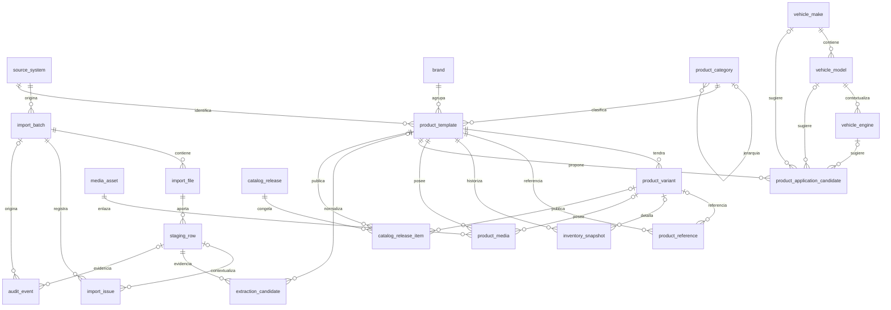

# Diseño de PostgreSQL

> **Propuesta v0.1 — No implementada**

Este documento describe una propuesta revisable. No autoriza instalar PostgreSQL, crear
tablas, generar migraciones ni programar el importador.

## 1. Alcance y evidencia disponible

La propuesta parte de:

- Odoo como fuente maestra;
- la exportación `product.template` de NATSUKI / empaques documentada en `DATA_SPEC.md`;
- 893 filas, 13 columnas y 893 referencias internas únicas en la muestra actual;
- ausencia de ID estable de Odoo, ID externo y registros individuales de `product.product`;
- nombres duplicados, cantidades con signo e imágenes opcionales;
- arquitectura oficial PostgreSQL + FastAPI + Jinja2/HTML/CSS/JavaScript.

Los nombres y tipos siguientes son lógicos. La revisión debe cerrarlos antes de producir DDL.

## 2. Objetivos y principios

1. **PostgreSQL es la base oficial.** SQLite no se considera base principal.
2. **Odoo es la fuente maestra.** El catálogo no debe sustituir ni reescribir el origen.
3. **Trazabilidad completa.** Todo dato normalizado debe apuntar a su importación, archivo y fila.
4. **Staging inmutable.** Las filas originales no se corrigen ni se reemplazan.
5. **Conservación del dato original.** Normalización y extracción se almacenan por separado.
6. **Cero eliminaciones automáticas.** Los cambios de vigencia son explícitos y auditables.
7. **Múltiples marcas y familias.** Marca y categoría son dimensiones, no constantes globales.
8. **Variantes futuras.** No se inventan variantes; se prepara su incorporación cuando Odoo las exporte.
9. **Historial de inventario.** Las cantidades se agregan como fotografías, nunca se sobrescriben.
10. **Publicaciones reproducibles.** Una versión publicada conserva exactamente sus productos y datos.
11. **Reconstrucción.** Staging, candidatos, snapshots y auditoría permiten reconstruir cada resultado.
12. **Fallos parciales visibles.** Una imagen o fecha inválida genera una incidencia, no la pérdida del producto.

## 3. Convenciones propuestas

- Claves internas: `uuid`, generadas independientemente de Odoo.
- Fechas del sistema: `timestamptz`; valores de Excel originales permanecen en `jsonb` de staging.
- Texto normalizado: columnas separadas; nunca reemplaza el texto original.
- Estados: `text` con `CHECK` en v0.1, en vez de tipos `ENUM`, para facilitar evolución.
- Hashes SHA-256: `char(64)` hexadecimal en minúsculas.
- Cantidades: `numeric`, sin restricción de signo.
- Metadatos variables y snapshots: `jsonb`, con esquema/versionado documentado.
- Todas las tablas mutables incluyen `created_at` y `updated_at`; las append-only solo `created_at`.
- FKs de evidencia, inventario, medios, auditoría y publicaciones usan `ON DELETE RESTRICT`.
- No se propone `ON DELETE CASCADE` para datos empresariales o de trazabilidad.
- Baja lógica mediante `is_active`, `archived_at` o estado; nunca por ausencia en una exportación.

Notación usada en columnas: **M** = obligatoria, **O** = opcional.

## 4. Diagrama entidad-relación

## 5. Resumen de tablas

| # | Tabla | Área | Responsabilidad principal |
|---:|---|---|---|
| 1 | `source_system` | Integración | Sistemas maestros y configuración de origen |
| 2 | `import_batch` | Integración | Ejecución completa de una importación |
| 3 | `import_file` | Integración | Archivo recibido, hash y metadatos |
| 4 | `staging_row` | Integración | Fila original inmutable |
| 5 | `import_issue` | Integración | Incidencias estructurales o por fila |
| 6 | `brand` | Catálogo | Marcas del catálogo |
| 7 | `product_category` | Catálogo | Jerarquía de categorías y familias |
| 8 | `product_template` | Catálogo | Producto a nivel `product.template` |
| 9 | `product_variant` | Catálogo | Variantes futuras de `product.product` |
| 10 | `product_reference` | Catálogo | Referencias internas, OEM y cruzadas |
| 11 | `inventory_snapshot` | Inventario | Fotografías históricas de cantidades |
| 12 | `media_asset` | Medios | Metadatos, hash, ubicación y estado de imagen |
| 13 | `product_media` | Medios | Asociación producto/variante con un recurso |
| 14 | `vehicle_make` | Aplicaciones | Marcas de vehículos normalizadas |
| 15 | `vehicle_model` | Aplicaciones | Modelos de vehículos normalizados |
| 16 | `vehicle_engine` | Aplicaciones | Motores contextualizados por modelo |
| 17 | `product_application_candidate` | Aplicaciones | Aplicaciones vehiculares aún no aprobadas |
| 18 | `extraction_candidate` | Extracción | Candidatos derivados del nombre u otro texto |
| 19 | `catalog_release` | Publicación | Versión inmutable del catálogo |
| 20 | `catalog_release_item` | Publicación | Producto y snapshot exacto de una versión |
| 21 | `audit_event` | Auditoría | Eventos append-only de cambios y decisiones |

## 6. Especificación de tablas

### 6.1 `source_system`

**Propósito:** registrar Odoo y futuros sistemas de origen sin codificarlos en lógica fija.

| Elemento | Propuesta |
|---|---|
| PK | `source_system_id uuid` |
| Columnas M | `code text`, `name text`, `system_type text`, `is_active boolean`, `created_at timestamptz` |
| Columnas O | `base_url text`, `instance_key text`, `timezone_name text`, `metadata jsonb`, `updated_at timestamptz` |
| FKs | Ninguna |
| Restricciones | `code` único; `system_type` no vacío; URL sin credenciales |
| Índices | Unique B-tree en `code`; índice en `is_active` |
| Actualización | Configuración editable con auditoría; secretos fuera de esta tabla |
| Eliminación | `RESTRICT`; desactivar con `is_active=false` |

### 6.2 `import_batch`

**Propósito:** representar una ejecución, su alcance, modo, estado y resultado agregado.

| Elemento | Propuesta |
|---|---|
| PK | `import_batch_id uuid` |
| Columnas M | `source_system_id uuid`, `mode text`, `status text`, `scope jsonb`, `started_at timestamptz`, `created_at timestamptz` |
| Columnas O | `finished_at timestamptz`, `requested_by text`, `approved_by text`, `profiler_version text`, `rules_version text`, `statistics jsonb`, `error_summary text` |
| FKs | `source_system_id -> source_system` |
| Restricciones | `mode IN ('dry_run','apply')`; estado dentro del flujo aprobado; `finished_at >= started_at` |
| Índices | `(source_system_id, started_at DESC)`, `status`, GIN en `scope` solo si las consultas lo justifican |
| Actualización | Solo transiciones válidas de estado; estadísticas se cierran al finalizar |
| Eliminación | `RESTRICT`; batch histórico no se borra |

### 6.3 `import_file`

**Propósito:** registrar cada archivo físico recibido y verificar su integridad.

| Elemento | Propuesta |
|---|---|
| PK | `import_file_id uuid` |
| Columnas M | `import_batch_id uuid`, `original_name text`, `storage_uri text`, `size_bytes bigint`, `sha256 char(64)`, `media_type text`, `received_at timestamptz` |
| Columnas O | `sheet_count integer`, `workbook_metadata jsonb`, `duplicate_of_file_id uuid` |
| FKs | `import_batch_id -> import_batch`; `duplicate_of_file_id -> import_file` |
| Restricciones | `size_bytes >= 0`; hash hexadecimal; nombre y URI no vacíos |
| Índices | `sha256`; `(import_batch_id, original_name)`; `duplicate_of_file_id` |
| Actualización | Hash, tamaño y URI son inmutables tras registro; solo se completan metadatos técnicos |
| Eliminación | `RESTRICT`; retención física pendiente de aprobación |

No se propone unicidad global del hash: una recepción repetida se registra y se enlaza a la
anterior para auditar el intento, aunque el procesamiento pueda detenerse como duplicado.

### 6.4 `staging_row`

**Propósito:** conservar cada fila exactamente como fue leída, antes de cualquier transformación.

| Elemento | Propuesta |
|---|---|
| PK | `staging_row_id uuid` |
| Columnas M | `import_file_id uuid`, `sheet_name text`, `source_row_number integer`, `raw_values jsonb`, `row_sha256 char(64)`, `validation_status text`, `created_at timestamptz` |
| Columnas O | `raw_headers jsonb`, `raw_excel_serials jsonb`, `structural_metadata jsonb` |
| FKs | `import_file_id -> import_file` |
| Restricciones | Unique `(import_file_id, sheet_name, source_row_number)`; fila >= 1; JSON de valores obligatorio |
| Índices | `(import_file_id, sheet_name, source_row_number)`, `row_sha256`, `validation_status`; GIN en `raw_values` solo si se demuestra necesario |
| Actualización | Append-only; solo `validation_status` puede avanzar mediante procedimiento auditado, o separarse en tabla de resultados |
| Eliminación | `RESTRICT`; política de retención abierta |

### 6.5 `import_issue`

**Propósito:** registrar errores, advertencias e información sin perder la fila afectada.

| Elemento | Propuesta |
|---|---|
| PK | `import_issue_id uuid` |
| Columnas M | `import_batch_id uuid`, `severity text`, `code text`, `message text`, `status text`, `created_at timestamptz` |
| Columnas O | `import_file_id uuid`, `staging_row_id uuid`, `column_name text`, `details jsonb`, `resolved_at timestamptz`, `resolved_by text`, `resolution_note text` |
| FKs | `import_batch_id -> import_batch`; opcionales `import_file_id -> import_file` y `staging_row_id -> staging_row` |
| Restricciones | `severity IN ('info','warning','error','fatal')`; estado `open/resolved/accepted` |
| Índices | `(import_batch_id, severity, status)`, `staging_row_id`, `code` |
| Actualización | Solo resolución/aceptación; mensaje y evidencia originales inmutables |
| Eliminación | `RESTRICT`; no borrar incidencias |

### 6.6 `brand`

**Propósito:** representar marcas de producto independientes dentro de la infraestructura común.

| Elemento | Propuesta |
|---|---|
| PK | `brand_id uuid` |
| Columnas M | `code text`, `name text`, `normalized_name text`, `is_active boolean`, `created_at timestamptz` |
| Columnas O | `source_system_id uuid`, `source_brand_id text`, `metadata jsonb`, `updated_at timestamptz` |
| FKs | `source_system_id -> source_system` |
| Restricciones | `code` único; unique contextual opcional `(source_system_id, source_brand_id)` cuando exista ID estable |
| Índices | `normalized_name`, `source_brand_id` |
| Actualización | Nombre y metadatos editables con auditoría; código estable |
| Eliminación | `RESTRICT`; baja lógica |

### 6.7 `product_category`

**Propósito:** conservar la categoría de Odoo y una jerarquía normalizada por familia.

| Elemento | Propuesta |
|---|---|
| PK | `product_category_id uuid` |
| Columnas M | `name text`, `normalized_name text`, `is_active boolean`, `created_at timestamptz` |
| Columnas O | `parent_category_id uuid`, `source_system_id uuid`, `source_category_id text`, `source_path text`, `updated_at timestamptz` |
| FKs | Padre a la misma tabla; origen a `source_system` |
| Restricciones | Sin ciclos; unique contextual del ID de origen cuando exista |
| Índices | `parent_category_id`, `normalized_name`, `(source_system_id, source_category_id)` |
| Actualización | Reparentado solo con revisión; conservar ruta original |
| Eliminación | `RESTRICT`; baja lógica |

### 6.8 `product_template`

**Propósito:** producto normalizado al nivel `product.template`, único nivel real de la exportación actual.

| Elemento | Propuesta |
|---|---|
| PK | `product_template_id uuid` |
| Columnas M | `source_system_id uuid`, `brand_id uuid`, `name_original text`, `variant_count_observed integer`, `is_active boolean`, `created_from_staging_row_id uuid`, `created_at timestamptz` |
| Columnas O | `product_category_id uuid`, `odoo_template_id text`, `odoo_external_id text`, `name_normalized text`, `currency_code text`, `uom_original text`, `activity_state text`, `is_favorite boolean`, `show_quantity_status boolean`, `source_updated_at timestamptz`, `last_confirmed_batch_id uuid`, `updated_at timestamptz` |
| FKs | `source_system_id -> source_system`; `brand_id -> brand`; opcionales a `product_category`; `created_from_staging_row_id -> staging_row`; `last_confirmed_batch_id -> import_batch` |
| Restricciones | `variant_count_observed >= 0`; nombre no es unique; IDs Odoo únicos solo dentro del sistema cuando existan |
| Índices | `(source_system_id, brand_id)`, `product_category_id`, `name_normalized`, IDs Odoo parciales, `last_confirmed_batch_id` |
| Actualización | Upsert controlado; cada cambio produce `audit_event`; ausencia en archivo no desactiva |
| Eliminación | `RESTRICT`; baja lógica explícita y nunca automática |

### 6.9 `product_variant`

**Propósito:** preparar variantes de `product.product` sin inventarlas a partir del contador actual.

| Elemento | Propuesta |
|---|---|
| PK | `product_variant_id uuid` |
| Columnas M | `product_template_id uuid`, `source_system_id uuid`, `is_active boolean`, `created_from_staging_row_id uuid`, `created_at timestamptz` |
| Columnas O | `odoo_variant_id text`, `odoo_external_id text`, `variant_name text`, `attributes jsonb`, `updated_at timestamptz` |
| FKs | Plantilla, origen y fila de procedencia |
| Restricciones | No crear sin fila/ID de variante real; IDs Odoo únicos por sistema cuando existan |
| Índices | `product_template_id`, IDs Odoo parciales |
| Actualización | Solo desde exportación de variantes o revisión humana documentada |
| Eliminación | `RESTRICT`; baja lógica |

`variant_count_observed` permanece en `product_template`. No se crean N filas de variante a
partir de ese número. Cuando se exporte `product.product`, los IDs estables enlazarán cada
variante a su `product_template` de Odoo; conflictos irán a revisión.

### 6.10 `product_reference`

**Propósito:** almacenar referencias internas, OEM, cruzadas y futuras referencias de proveedor.

| Elemento | Propuesta |
|---|---|
| PK | `product_reference_id uuid` |
| Columnas M | `source_system_id uuid`, `brand_id uuid`, `product_template_id uuid`, `reference_type text`, `value_original text`, `value_normalized text`, `is_primary boolean`, `created_at timestamptz` |
| Columnas O | `product_variant_id uuid`, `staging_row_id uuid`, `confidence numeric(5,4)`, `review_status text`, `updated_at timestamptz` |
| FKs | IDs de origen, marca y plantilla a sus tablas; opcionales `product_variant_id -> product_variant` y `staging_row_id -> staging_row` |
| Restricciones | Valor no vacío; si hay variante debe pertenecer a la plantilla; confianza 0..1 |
| Índices | No unique en `(source_system_id, brand_id, value_normalized)`; índice de búsqueda sobre esa terna; índice por producto y tipo |
| Actualización | Original inmutable; normalización versionada/auditada; conflictos no se sobreescriben |
| Eliminación | `RESTRICT`; marcar vigencia o revisión, no borrar automáticamente |

La conciliación provisional usa `source_system + brand + referencia normalizada`. La ausencia
de restricción unique intencional permite detectar duplicados futuros y enviarlos a revisión
en lugar de rechazar o fusionar datos.

### 6.11 `inventory_snapshot`

**Propósito:** conservar cada fotografía de inventario sin sobrescribir el historial.

| Elemento | Propuesta |
|---|---|
| PK | `inventory_snapshot_id uuid` |
| Columnas M | `product_template_id uuid`, `import_batch_id uuid`, `staging_row_id uuid`, `quantity_on_hand numeric`, `quantity_available numeric`, `uom_original text`, `captured_at timestamptz`, `created_at timestamptz` |
| Columnas O | `product_variant_id uuid`, `source_updated_at timestamptz`, `source_date_serial numeric`, `metadata jsonb` |
| FKs | `product_template_id -> product_template`; opcional `product_variant_id -> product_variant`; batch y fila a `import_batch` y `staging_row` |
| Restricciones | Valores positivos, cero y negativos permitidos; variante coherente con plantilla |
| Índices | `(product_template_id, captured_at DESC)`, `(product_variant_id, captured_at DESC)`, `import_batch_id` |
| Actualización | Append-only; una corrección genera un nuevo snapshot o evento correctivo |
| Eliminación | `RESTRICT`; retención pendiente de aprobación |

### 6.12 `media_asset`

**Propósito:** separar el contenido multimedia del producto y controlar su validación/procesamiento.

| Elemento | Propuesta |
|---|---|
| PK | `media_asset_id uuid` |
| Columnas M | `source_system_id uuid`, `status text`, `created_from_staging_row_id uuid`, `created_at timestamptz` |
| Columnas O | `content_sha256 char(64)`, `media_type text`, `byte_size bigint`, `storage_uri text`, `original_filename text`, `error_code text`, `error_message text`, `processed_at timestamptz`, `metadata jsonb` |
| FKs | Origen y fila de procedencia |
| Restricciones | Estado en `presente/ausente/error_de_exportacion/invalida/procesada`; hash unique parcial cuando exista; tamaño >= 0 |
| Índices | `content_sha256`, `status`, `created_from_staging_row_id` |
| Actualización | Transiciones de procesamiento auditadas; contenido original permanece en staging |
| Eliminación | `RESTRICT`; nunca eliminar automáticamente recursos originales de Odoo |

El Base64 no se guarda en `product_template`. Primero se valida estructura/tipo, luego se
decodifica fuera de la transacción principal, se calcula hash y se almacena por URI. Un error
no bloquea el producto. El sistema nunca modifica ni elimina imágenes originales de Odoo.

### 6.13 `product_media`

**Propósito:** asociar recursos a plantilla o variante con rol y orden.

| Elemento | Propuesta |
|---|---|
| PK | `product_media_id uuid` |
| Columnas M | `product_template_id uuid`, `media_asset_id uuid`, `role text`, `sort_order integer`, `created_at timestamptz` |
| Columnas O | `product_variant_id uuid`, `caption text`, `is_primary boolean` |
| FKs | Plantilla, variante y recurso |
| Restricciones | Variante coherente con plantilla; unicidad mediante índices parciales separados para plantilla y variante, evitando duplicados causados por `NULL` |
| Índices | Producto/variante, `media_asset_id`, índice parcial para `is_primary` |
| Actualización | Rol/orden editables con auditoría; no reemplazar el recurso original |
| Eliminación | `RESTRICT`; desasociación manual explícita, nunca por importación ausente |

### 6.14 `vehicle_make`

**Propósito:** vocabulario normalizado de marcas de vehículos.

| Elemento | Propuesta |
|---|---|
| PK | `vehicle_make_id uuid` |
| Columnas M | `name text`, `normalized_name text`, `review_status text`, `created_at timestamptz` |
| Columnas O | `source_code text`, `updated_at timestamptz` |
| FKs | Ninguna |
| Restricciones | `normalized_name` unique solo tras aprobación; candidatos permanecen separados |
| Índices | `normalized_name`, `review_status` |
| Actualización | Fusiones solo mediante decisión humana auditada |
| Eliminación | `RESTRICT`; desactivar o fusionar con redirección auditada |

### 6.15 `vehicle_model`

**Propósito:** modelos de vehículo contextualizados por marca.

| Elemento | Propuesta |
|---|---|
| PK | `vehicle_model_id uuid` |
| Columnas M | `vehicle_make_id uuid`, `name text`, `normalized_name text`, `review_status text`, `created_at timestamptz` |
| Columnas O | `source_code text`, `updated_at timestamptz` |
| FKs | `vehicle_make_id -> vehicle_make` |
| Restricciones | Unique aprobado `(vehicle_make_id, normalized_name)` |
| Índices | `vehicle_make_id`, `normalized_name`, `review_status` |
| Actualización | Normalización/fusión con revisión humana |
| Eliminación | `RESTRICT` |

### 6.16 `vehicle_engine`

**Propósito:** motores normalizados dentro del contexto conocido del modelo.

| Elemento | Propuesta |
|---|---|
| PK | `vehicle_engine_id uuid` |
| Columnas M | `name text`, `normalized_name text`, `review_status text`, `created_at timestamptz` |
| Columnas O | `vehicle_model_id uuid`, `engine_code text`, `displacement_liters numeric(6,3)`, `cylinders smallint`, `attributes jsonb`, `updated_at timestamptz` |
| FKs | `vehicle_model_id -> vehicle_model` |
| Restricciones | Cilindros y cilindrada positivos cuando existan; no unique global por nombre |
| Índices | `vehicle_model_id`, `engine_code`, `normalized_name` |
| Actualización | Candidatos no aprobados no consolidan motores automáticamente |
| Eliminación | `RESTRICT` |

### 6.17 `product_application_candidate`

**Propósito:** conservar una aplicación vehicular extraída o importada hasta su aprobación.

| Elemento | Propuesta |
|---|---|
| PK | `product_application_candidate_id uuid` |
| Columnas M | `product_template_id uuid`, `staging_row_id uuid`, `evidence_original text`, `rule_code text`, `rule_version text`, `confidence numeric(5,4)`, `review_status text`, `created_at timestamptz` |
| Columnas O | `vehicle_make_id uuid`, `vehicle_model_id uuid`, `vehicle_engine_id uuid`, `year_from smallint`, `year_to smallint`, `position text`, `notes text`, `reviewed_by text`, `reviewed_at timestamptz` |
| FKs | `product_template_id -> product_template`; `staging_row_id -> staging_row`; entidades vehiculares opcionales a sus tablas |
| Restricciones | Confianza 0..1; años coherentes; estado `pending/approved/rejected` |
| Índices | `product_template_id`, `review_status`, IDs vehiculares, rango de años |
| Actualización | Evidencia/regla inmutables; solo revisión y resolución editables |
| Eliminación | `RESTRICT`; candidatos rechazados se conservan |

### 6.18 `extraction_candidate`

**Propósito:** registrar cualquier dato derivado de `Nombre` u otro texto con procedencia completa.

| Elemento | Propuesta |
|---|---|
| PK | `extraction_candidate_id uuid` |
| Columnas M | `staging_row_id uuid`, `candidate_type text`, `evidence_original text`, `value_original text`, `value_normalized text`, `rule_code text`, `rule_version text`, `confidence numeric(5,4)`, `review_status text`, `created_at timestamptz` |
| Columnas O | `product_template_id uuid`, `target_field text`, `reviewed_by text`, `reviewed_at timestamptz`, `review_note text` |
| FKs | Fila y producto opcional |
| Restricciones | Confianza 0..1; estado `pending/approved/rejected`; regla/version no vacías |
| Índices | `(candidate_type, review_status)`, `staging_row_id`, `product_template_id` |
| Actualización | Evidencia, valores y regla inmutables; revisión append/auditada |
| Eliminación | `RESTRICT` |

### 6.19 `catalog_release`

**Propósito:** representar una versión del catálogo con ciclo `draft/published/archived`.

| Elemento | Propuesta |
|---|---|
| PK | `catalog_release_id uuid` |
| Columnas M | `brand_id uuid`, `version text`, `status text`, `definition jsonb`, `created_at timestamptz`, `created_by text` |
| Columnas O | `published_at timestamptz`, `published_by text`, `archived_at timestamptz`, `notes text`, `snapshot_sha256 char(64)` |
| FKs | `brand_id -> brand` |
| Restricciones | Unique `(brand_id, version)`; estados `draft/published/archived`; publicación requiere hash |
| Índices | `(brand_id, status)`, `published_at DESC`, `snapshot_sha256` |
| Actualización | Draft editable; published inmutable; archived solo cambia estado/fecha |
| Eliminación | `RESTRICT`; ninguna versión publicada se borra |

### 6.20 `catalog_release_item`

**Propósito:** congelar exactamente qué producto y datos formaron parte de una publicación.

| Elemento | Propuesta |
|---|---|
| PK | `catalog_release_item_id uuid` |
| Columnas M | `catalog_release_id uuid`, `product_template_id uuid`, `item_order integer`, `snapshot_schema_version text`, `snapshot_data jsonb`, `snapshot_sha256 char(64)`, `created_at timestamptz` |
| Columnas O | `product_variant_id uuid`, `section_key text`, `grouping_keys jsonb`, `source_import_batch_id uuid` |
| FKs | `catalog_release_id -> catalog_release`; `product_template_id -> product_template`; opcionales a `product_variant` e `import_batch` |
| Restricciones | Unique `(catalog_release_id, item_order)`; snapshot/hash obligatorios; variante coherente |
| Índices | `catalog_release_id`, producto/variante, `section_key`, `snapshot_sha256` |
| Actualización | Editable solo mientras release sea draft; inmutable al publicar |
| Eliminación | Sin borrado en published/archived; cambios de draft son explícitos y auditados |

El `snapshot_data` canónico propuesto es JSON versionado. XML para InDesign se generaría con
un adaptador, pero esta recomendación permanece abierta hasta aprobación.

### 6.21 `audit_event`

**Propósito:** bitácora append-only de cambios, conciliaciones y decisiones humanas.

| Elemento | Propuesta |
|---|---|
| PK | `audit_event_id uuid` |
| Columnas M | `event_type text`, `entity_type text`, `entity_id uuid`, `occurred_at timestamptz`, `actor_type text`, `actor_id text`, `after_data jsonb`, `event_sha256 char(64)` |
| Columnas O | `import_batch_id uuid`, `staging_row_id uuid`, `before_data jsonb`, `reason text`, `correlation_id uuid`, `metadata jsonb` |
| FKs | Batch y fila de evidencia; la entidad se valida en la capa de dominio por ser polimórfica |
| Restricciones | Append-only; hash obligatorio; actor y razón requeridos para decisiones humanas |
| Índices | `(entity_type, entity_id, occurred_at)`, `import_batch_id`, `correlation_id`, `event_type` |
| Actualización | Ninguna; las correcciones generan otro evento |
| Eliminación | Prohibida salvo política legal aprobada y registrada externamente |

## 7. Identidad y conciliación

1. Cada entidad del catálogo recibe un UUID interno estable.
2. IDs de Odoo, externos, de plantilla y variante son opcionales hasta recibirlos.
3. `Nombre` nunca identifica un producto.
4. Cantidades, imagen y fechas nunca participan en identidad.
5. `Referencia interna` no se declara globalmente unique.
6. La conciliación provisional usa sistema fuente + marca + referencia normalizada.
7. Una coincidencia única puede proponerse; cero o varias coincidencias requieren revisión.
8. La normalización nunca destruye la referencia original.
9. Un conflicto no se resuelve sobrescribiendo: queda en `import_issue` y `audit_event`.

## 8. Fechas y sistema de Excel

- El serial original se conserva en `staging_row.raw_excel_serials`.
- La conversión debe declarar explícitamente el sistema de fechas del libro: 1900 o 1904.
- Debe corregirse de forma consciente la compatibilidad histórica del “29-02-1900”.
- El origen debe declarar zona horaria; provisionalmente se evaluará `America/Panama`.
- La salida normalizada se guarda como `timestamptz`, preferiblemente en UTC.
- Una fecha inválida crea `import_issue`; no rechaza por sí sola toda la fila.

## 9. Inmutabilidad y eliminación

- `staging_row`, `inventory_snapshot`, candidatos aprobados/rechazados, releases publicados y
  `audit_event` son append-only.
- Productos, marcas y categorías se desactivan lógicamente, nunca por ausencia en un archivo.
- Ninguna FK empresarial usa cascada de borrado.
- Una operación administrativa excepcional debe exigir autorización, respaldo y evento de auditoría.

## 10. Versionado de catálogos

### Modelo propuesto

1. Un release nace en `draft` con definición de filtros, agrupación, orden y plantilla.
2. Cada item guarda un snapshot JSON canónico, versión de esquema y SHA-256.
3. Al publicar, se valida completitud, se calcula hash global y se bloquean release e items.
4. `published` puede pasar a `archived`, pero su contenido no cambia.
5. Una corrección crea una versión nueva; nunca reescribe una publicada.

### Ventajas

- reproducción exacta de PDF, web o InDesign;
- auditoría de qué vio un cliente en una fecha;
- independencia frente a cambios posteriores del producto;
- comparación determinista entre versiones.

### Riesgos

- crecimiento de JSON e imágenes referenciadas;
- necesidad de versionar el esquema del snapshot;
- riesgo de inconsistencias si un adaptador omite campos;
- políticas de retención y archivado todavía no aprobadas.

### Recomendación preliminar no aprobada

Usar JSON inmutable como snapshot canónico interno y generar XML mediante un adaptador
específico para InDesign. No se considera una decisión cerrada.

## 11. Criterios para aprobar v0.1

- Validar las 21 tablas y sus límites de responsabilidad.
- Aprobar identidad provisional y tratamiento de duplicados.
- Confirmar zona horaria y sistema de fechas de Excel.
- Aprobar estrategia de imágenes y retención de staging.
- Aprobar modelo de releases y snapshot JSON/XML.
- Confirmar que el diseño soporta futuras exportaciones `product.product`.
- Solo después: producir DDL/migraciones y plan de pruebas de base de datos.

## 12. Decisiones abiertas y recomendaciones no aprobadas

| Decisión | Alternativas | Recomendación preliminar | Ventajas | Riesgos | Impacto de cambiar después |
|---|---|---|---|---|---|
| Identidad definitiva con IDs de Odoo | UUID interno; ID Odoo como PK; UUID + alias Odoo | UUID interno + IDs Odoo contextuales opcionales | Estabilidad local y desacoplamiento | Conciliación inicial más compleja | Alto si se usa ID externo como PK desde el inicio |
| Referencias duplicadas futuras | Rechazar; fusionar; permitir y revisar | Permitir duplicados contextualizados y enviar ambigüedad a revisión | Evita pérdida y fusiones falsas | Más estados y UI de resolución | Alto si se impone unique antes de conocer casos reales |
| Ubicación física de imágenes | `bytea`; filesystem; object storage | Filesystem local direccionado por hash, URI en DB; evaluar object storage después | DB liviana y deduplicación | Backup coordinado entre DB y archivos | Medio si se encapsula detrás de `storage_uri` |
| Retención de staging | Indefinida; ventana fija; archivo frío | Indefinida durante fases iniciales; decidir archivado con métricas reales | Máxima trazabilidad | Crecimiento y posibles obligaciones de privacidad | Alto si se elimina evidencia antes de definir política |
| Publicaciones de catálogo | Datos vivos; snapshot completo; modelo híbrido | Snapshot JSON inmutable por release | Reproducción exacta | Mayor almacenamiento y versionado de schema | Alto si primero se publican referencias dinámicas |
| JSON canónico vs XML InDesign | XML canónico; JSON canónico; ambos | JSON canónico + adaptador XML para InDesign | Flexible, testeable y útil para web/API | Debe validarse fidelidad del adaptador | Bajo/medio si el adaptador es frontera explícita |
| Historial de inventario | Solo actual; cada importación; solo cambios | Snapshot por importación; evaluar compactación posterior | Auditoría completa y simple | Volumen creciente | Medio si existe batch y timestamp desde el inicio |
| Zona horaria oficial | UTC; `America/Panama`; zona Odoo | Guardar UTC y registrar zona fuente; usar `America/Panama` solo tras confirmación | Comparación consistente | Conversión incorrecta si la zona declarada es falsa | Alto: corregir timestamps históricos es costoso |
| Extracción vehicular | Automática; manual; híbrida por confianza | Reglas versionadas + confianza + revisión humana | Escala sin convertir inferencias en hechos | Cola de revisión y calibración | Medio si evidencia/regla se conservan desde el inicio |
