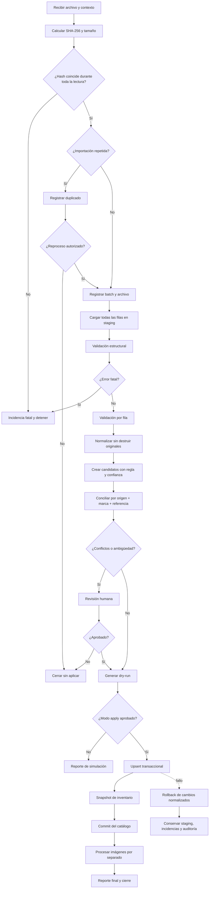

# Diseño del importador de Odoo

> **Propuesta v0.1 — No implementada**

Este documento define un flujo revisable. No contiene código ejecutable, no crea tablas y no
autoriza instalar PostgreSQL ni programar el importador definitivo.

## 1. Alcance

El importador propuesto recibe archivos Excel/CSV de Odoo, conserva toda la evidencia en
staging, valida, normaliza, concilia y presenta un dry-run antes de cualquier escritura en el
catálogo. La primera evidencia es la exportación `product.template` de NATSUKI / empaques:
893 filas, 13 columnas, 893 referencias internas únicas y 22 grupos de nombres duplicados.

Principios:

- Odoo sigue siendo la fuente maestra.
- El archivo se lee sin modificarlo.
- Toda fila entra en staging, incluso si contiene errores.
- El dato original nunca se sustituye por el normalizado.
- No se inventan variantes, IDs, aplicaciones ni imágenes.
- No se excluyen productos por stock cero/negativo o imagen ausente.
- No se fusiona por nombre.
- No se elimina ningún producto automáticamente.
- Todo cambio aplicado es transaccional, idempotente y auditable.

## 2. Entradas y salidas

### Entradas

- archivo `.xlsx`, `.csv` o `.tsv`;
- sistema fuente e instancia;
- alcance declarado: modelo, marca, familia y filtros;
- modo `dry_run` o `apply`;
- versión del perfilador y de las reglas;
- identidad de quien solicita y, cuando corresponda, aprueba.

### Salidas

- `import_batch` e `import_file` registrados;
- filas inmutables en `staging_row`;
- incidencias en `import_issue`;
- candidatos de extracción/aplicación;
- plan de cambios del dry-run;
- cambios normalizados, snapshots y eventos solo en modo aprobado;
- reporte JSON y Markdown con hash, métricas, decisiones y errores.

## 3. Estados de una importación

| Estado | Significado | Puede avanzar a |
|---|---|---|
| `received` | Solicitud y archivo recibidos | `hashing`, `cancelled` |
| `hashing` | Hash/tamaño en cálculo | `duplicate_detected`, `registered`, `failed` |
| `duplicate_detected` | Hash ya procesado o recibido | `cancelled`, `registered` con autorización de reproceso |
| `registered` | Batch y archivo registrados | `staging`, `failed` |
| `staging` | Filas originales en carga | `validating`, `failed` |
| `validating` | Validaciones estructurales y por fila | `normalizing`, `blocked`, `failed` |
| `normalizing` | Valores normalizados/candidatos | `reconciling`, `failed` |
| `reconciling` | Búsqueda de productos existentes | `awaiting_review`, `ready`, `failed` |
| `awaiting_review` | Conflictos requieren decisión humana | `ready`, `cancelled` |
| `ready` | Plan coherente y aprobado para simular/aplicar | `dry_run_complete`, `applying` |
| `dry_run_complete` | Simulación terminada sin cambios empresariales | `awaiting_review`, `applying`, `completed` |
| `applying` | Upsert transaccional en curso | `completed`, `completed_with_warnings`, `rolled_back`, `failed` |
| `completed` | Proceso terminado sin advertencias abiertas | Estado final |
| `completed_with_warnings` | Terminado con advertencias aceptadas | Estado final |
| `blocked` | Incidencia impide avanzar sin corrección/revisión | `validating`, `cancelled` |
| `rolled_back` | Escrituras normalizadas revertidas; staging conservado | `ready`, `cancelled` |
| `failed` | Fallo técnico no recuperado | `registered`, `staging`, `ready` según checkpoint |
| `cancelled` | Cancelación explícita y auditada | Estado final |

Las transiciones inválidas deben rechazarse y registrarse en `audit_event`.

## 4. Severidad de incidencias y reglas de avance

| Severidad | Ejemplo | Efecto por fila | Efecto por batch |
|---|---|---|---|
| `info` | Campo opcional vacío esperado | Continúa | Continúa |
| `warning` | Imagen ausente o fecha no convertible | Continúa sin ese dato normalizado | Puede terminar con advertencias |
| `error` | Referencia ausente, cantidad inválida o match ambiguo | Fila no se aplica automáticamente | Continúa staging; requiere revisión si afecta conciliación |
| `fatal` | Hash cambia durante lectura, XLSX corrupto o columnas críticas incompatibles | No aplica | Detiene antes del upsert |

Reglas:

1. Ninguna severidad evita conservar la evidencia que ya llegó a staging.
2. Un `fatal` abierto bloquea todo `apply`.
3. Un `error` de identidad bloquea esa fila y puede llevar el batch a `awaiting_review`.
4. Un error de imagen o fecha no debe bloquear los demás datos del producto.
5. Advertencias pueden aceptarse solo con actor, fecha y justificación.
6. El umbral de errores permitido debe formar parte de la configuración versionada.

## 5. Flujo completo



### 5.1 Recepción del archivo

- Validar extensión admitida, legibilidad, tamaño máximo configurable y contexto mínimo.
- No abrir con Excel ni guardar una versión nueva.
- Capturar nombre original, URI local controlada, usuario y alcance declarado.
- Confirmar que la marca/familia provienen del contexto de exportación si no son columnas.

### 5.2 Cálculo del hash

- Calcular SHA-256 por streaming antes de interpretar el contenido.
- Registrar tamaño y fecha de recepción.
- Recalcular al terminar la lectura; cualquier diferencia es `fatal`.

### 5.3 Detección de importaciones repetidas

- Buscar el hash en `import_file` para el mismo `source_system`.
- Registrar siempre el intento y enlazar `duplicate_of_file_id`.
- Por defecto no volver a aplicar un archivo ya completado con la misma versión de reglas.
- Permitir reproceso explícito para nuevas reglas, únicamente en dry-run hasta aprobación.

### 5.4 Registro de `import_batch` e `import_file`

- Crear registros en una transacción corta.
- Guardar alcance, modo, versiones, actores y hash.
- No incluir credenciales, Base64 ni datos sensibles en logs.

### 5.5 Lectura sin modificación

- Abrir el archivo en modo lectura/binario.
- Usar el perfilador existente como validación previa.
- Preservar encabezados, nombres de hoja, números de fila, seriales y valores originales.

### 5.6 Carga completa de staging

- Insertar todas las filas, incluidas las vacías/anómalas si el archivo las declara usadas.
- Crear `row_sha256` determinista sobre encabezados + valores originales canónicos.
- Escribir por lotes; cada lote confirmado es un checkpoint recuperable.
- Nunca corregir datos dentro de `staging_row`.

### 5.7 Validación estructural

- Verificar hojas, encabezados, duplicados de encabezado y rango usado.
- Comparar contra un contrato versionado, no contra posiciones codificadas.
- Columnas desconocidas generan advertencia y se conservan.
- Ausencia de una columna crítica genera error/fatal según el modo.

### 5.8 Validación por fila

- Verificar tipos, nulos, longitudes, caracteres de control y coherencia numérica.
- Aceptar cantidades positivas, cero y negativas.
- No exigir imagen.
- Validar referencia como texto y preservar ceros/puntuación.
- Crear una incidencia por problema con fila y columna exactas.

### 5.9 Normalización

- Generar valores normalizados en memoria o tablas de trabajo, nunca en staging.
- Aplicar reglas versionadas y deterministas.
- Mantener original, normalizado, regla, versión y confianza.
- No transformar una inferencia en dato aprobado sin revisión.

### 5.10 Conciliación

Orden de comparación propuesto:

1. ID estable de Odoo + sistema fuente, cuando exista.
2. ID externo + sistema fuente, cuando exista.
3. Provisionalmente: sistema fuente + marca + referencia interna normalizada.
4. Señales auxiliares para revisión: categoría, nombre y unidad; nunca como identidad autónoma.

Resultados posibles: `new`, `exact_match`, `possible_match`, `ambiguous`, `conflict`, `blocked`.

### 5.11 Detección de conflictos

- Varias plantillas para la misma clave provisional.
- Una plantilla con otra referencia primaria incompatible.
- Cambio de marca, categoría o unidad no explicado.
- ID Odoo que apunta a UUID distinto del match por referencia.
- Variante exportada sin plantilla estable conocida.

Los conflictos se registran; no se resuelven por “último archivo gana”.

### 5.12 Simulación o dry-run

El dry-run debe producir, sin modificar catálogo:

- altas propuestas;
- actualizaciones campo por campo;
- coincidencias exactas y ambiguas;
- filas bloqueadas;
- snapshots que se crearían;
- medios que entrarían a cola;
- incidencias por severidad;
- checksum del plan para aprobar exactamente esa simulación.

### 5.13 Revisión humana

- Mostrar evidencia original y propuestas lado a lado.
- Registrar aprobar/rechazar/crear nuevo/enlazar existente.
- Exigir comentario en conflictos y coincidencias ambiguas.
- Invalidar la aprobación si cambia archivo, reglas o plan.

### 5.14 Upsert transaccional

- Verificar nuevamente hash, versión de reglas y checksum aprobado.
- Bloquear únicamente productos afectados.
- Insertar/actualizar por UUID interno y match aprobado.
- Generar `audit_event` por cada cambio.
- No desactivar registros ausentes en la exportación.

### 5.15 Snapshot de inventario

- Crear una fila append-only por producto/fila aplicada.
- Conservar cantidad real, disponible, unidad, importación y fecha de procedencia.
- No sobrescribir el snapshot anterior.
- No omitir valores cero o negativos.

### 5.16 Procesamiento independiente de imágenes

- Ejecutar después del commit normalizado, en una cola/reintento separado.
- Clasificar `presente`, `ausente`, `error_de_exportacion`, `invalida` o `procesada`.
- Validar Base64 y firma de archivo antes de decodificar.
- Calcular SHA-256 del contenido y deduplicar por hash.
- Guardar URI/metadatos en `media_asset`, no Base64 en el producto.
- Una imagen inválida nunca revierte el producto.
- Nunca modificar ni eliminar imágenes originales de Odoo.

### 5.17 Generación del reporte

Generar JSON y Markdown con:

- IDs, hash, alcance, modo y versiones;
- timestamps/duración por etapa;
- conteos leídos, staged, válidos, bloqueados, nuevos y actualizados;
- matches, conflictos y decisiones humanas;
- incidencias por código/severidad;
- snapshots y medios creados/pendientes;
- checksum del dry-run y resultado del commit/rollback;
- rutas de reportes sin incluir datos sensibles en logs de consola.

### 5.18 Cierre o rollback

- Si falla antes del apply, conservar staging y marcar checkpoint.
- Si falla el apply, revertir toda la transacción de catálogo/snapshots del batch.
- Nunca revertir el registro del batch, staging, incidencias o auditoría.
- Imágenes tienen compensación/reintento independiente.
- Cerrar solo después de reconciliar métricas y registrar estado final.

## 6. Matriz de las 13 columnas reales

La matriz contiene únicamente columnas presentes en la exportación. Marca y familia son
contexto declarado del batch, no columnas inventadas.

| Columna exacta de origen | Tipo observado | Destino propuesto | Transformación | Validaciones | ¿Nulo aceptado? | Comportamiento ante error | ¿Conciliación? |
|---|---|---|---|---|---|---|---|
| Moneda | texto | `product_template.currency_code` | Trim conservando original; mapear a código validado sin reemplazar raw | Texto, longitud y código conocido | Sí en normalizado; no ocurrió en muestra | Warning; conservar raw y dejar normalizado nulo | No |
| Estado de la actividad | vacío en 893 filas | `product_template.activity_state` | Ninguna si está vacío | Si aparece, tratar como texto y registrar valor nuevo | Sí | Info/Warning si aparece valor no contemplado; no bloquear | No |
| Categoría de producto | texto | `product_category.source_path` + FK de `product_template` | Conservar ruta; segmentar/normalizar por regla versionada | No vacío en muestra; jerarquía sin ciclos | No para apply automático | Error de fila; staging continúa y producto queda bloqueado | No; solo señal auxiliar |
| Favorito | booleano | `product_template.is_favorite` | Conversión estricta de booleano | Solo booleano o representación aprobada | Sí en normalizado | Warning y valor normalizado nulo | No |
| Nombre | texto | `product_template.name_original`; candidatos en `extraction_candidate` | Conservar íntegro; normalización separada; extraer candidatos | No vacío, límites, caracteres de control | No para producto aplicable | Error de fila si vacío; nunca usar para fusionar | No |
| Referencia interna | texto | `product_reference.value_original/value_normalized` | Normalización versionada sin perder ceros, guiones, espacios significativos ni puntuación | No vacío para conciliación; longitud; ambigüedad contextual | No para match automático; sí en staging | Error y revisión humana; no inventar referencia | Sí, provisionalmente con sistema fuente + marca |
| # Variantes de producto | entero | `product_template.variant_count_observed` | Conversión a entero no negativo | Entero >= 0 | Sí en normalizado si falla | Error/Warning; conservar raw y no crear variantes | No |
| Cantidad real | entero observado | `inventory_snapshot.quantity_on_hand` | Conversión a `numeric`, conservar signo | Numérico; positivos, cero y negativos válidos | Sí para producto; no para snapshot completo | Error del snapshot; producto puede continuar | No |
| Unidad de medida | texto | `product_template.uom_original` e `inventory_snapshot.uom_original` | Trim y lookup opcional, conservando texto | Texto no vacío en muestra | Sí en normalizado | Warning; conservar original y evitar conversión de unidades | No |
| Cantidad disponible | entero observado | `inventory_snapshot.quantity_available` | Conversión a `numeric`, conservar signo | Numérico; positivos, cero y negativos válidos | Sí para producto; no para snapshot completo | Error del snapshot; producto puede continuar | No |
| Imagen 128 | texto o vacío | raw en `staging_row`; estado/URI/hash en `media_asset` y vínculo en `product_media` | Clasificar; validar Base64/formato; decodificar asincrónicamente | Vacío permitido; firma/tamaño/tipo antes de procesar | Sí | Warning; estado `ausente/error_de_exportacion/invalida`; nunca bloquear producto | No |
| Última actualización el | serial decimal Excel | raw en `staging_row.raw_excel_serials`; `product_template.source_updated_at` | Convertir con sistema 1900/1904 y zona fuente confirmados | Rango plausible; conversión reversible; zona declarada | Sí en normalizado | Warning; conservar serial y dejar fecha nula | No |
| Mostrar botón de estado de cantidad real | booleano | `product_template.show_quantity_status` | Conversión estricta de booleano | Solo booleano o representación aprobada | Sí en normalizado | Warning y valor normalizado nulo | No |

## 7. Datos derivados de `Nombre`

Marca de vehículo, modelo, motor, cilindrada, años, posición/lado, material, medidas y
observaciones se guardan como candidatos. Cada candidato incluye:

- `evidence_original` y posición dentro del texto;
- `value_original` y `value_normalized`;
- `rule_code` y `rule_version`;
- `confidence` entre 0 y 1;
- `review_status` (`pending`, `approved`, `rejected`);
- `staging_row_id`, producto opcional y actor de revisión.

Una regla nueva crea nuevos candidatos; no reescribe los anteriores. Los aprobados pueden
alimentar entidades vehiculares, pero la evidencia y decisión permanecen auditables.

## 8. Idempotencia

- **Archivo:** SHA-256 + sistema fuente detectan recepciones repetidas.
- **Staging:** unique `(import_file_id, sheet_name, source_row_number)` y hash de fila.
- **Reglas:** resultado identificado por fila + regla + versión; reejecutar no duplica candidatos.
- **Conciliación:** usa IDs estables cuando existan o clave provisional contextual.
- **Apply:** un batch aplicado no se aplica de nuevo sin una autorización de reproceso distinta.
- **Inventario:** unique lógico por batch + fila + producto evita duplicar snapshots en reintentos.
- **Auditoría:** `correlation_id` y hash de evento permiten detectar repeticiones.

Un mismo archivo con una nueva versión de reglas puede reprocesarse para comparar resultados,
pero no aplicar cambios hasta aprobar un dry-run nuevo.

## 9. Límites de transacción

1. **Registro:** transacción corta para batch/archivo.
2. **Staging:** lotes configurables, cada uno con checkpoint; no mezcla productos normalizados.
3. **Validación/extracción:** resultados durables por etapa y versión.
4. **Apply:** para el volumen actual, una transacción atómica por batch aprobado que incluya
   productos, referencias, candidatos aprobados, snapshots y auditoría.
5. **Medios:** transacciones independientes por recurso después del commit del producto.
6. **Reporte/cierre:** transacción corta que reconcilia métricas y estado.

Para volúmenes futuros mayores se evaluará partición por marca/familia, sin sacrificar la
capacidad de identificar exactamente qué subconjunto fue confirmado o revertido.

## 10. Recuperación y reintentos

| Falla | Recuperación | Reintento |
|---|---|---|
| Lectura/hash | Marcar `failed`, no aplicar | Manual tras verificar archivo |
| Staging por lote | Reanudar desde último checkpoint | Automático idempotente |
| Validación determinista | Corregir contrato/regla, crear versión nueva | Manual/versionado |
| Conexión PostgreSQL transitoria | Mantener estado previo y correlation ID | Máximo 3 con backoff |
| Deadlock/serialización en apply | Rollback total del apply | Máximo 3 si el plan aprobado no cambió |
| Conflicto de conciliación | `awaiting_review` | Tras decisión humana |
| Imagen inválida | Producto permanece confirmado | Reintento solo si fue falla transitoria |
| Escritura de reporte | Batch queda aplicado pero “cierre pendiente” | Regenerar desde DB/auditoría |

No se reintentan automáticamente errores de datos. Cada reintento conserva el mismo
`correlation_id` y añade eventos, sin borrar el intento anterior.

## 11. Auditoría y seguridad operacional

Registrar como mínimo:

- recepción, hash, duplicado y cambio de estado;
- versiones de contrato, perfilador y reglas;
- actor que solicita, revisa y aprueba;
- match seleccionado y alternativas descartadas;
- before/after de cada upsert;
- snapshot de inventario creado;
- estado de medio y hash de contenido;
- rollback, reintentos y resoluciones de incidencias.

Los logs operativos no deben contener Base64, credenciales ni filas completas. La evidencia
empresarial vive en staging protegido y los reportes locales permanecen ignorados por Git.

## 12. Métricas

- bytes y tiempo de hash/lectura;
- hojas, filas físicas, filas staged y columnas;
- filas válidas, con warning, error, fatal y bloqueadas;
- altas, actualizaciones, sin cambio, matches ambiguos y conflictos;
- candidatos por tipo/confianza/estado;
- snapshots creados y distribución de cantidades sin exponer referencias;
- medios presentes, ausentes, inválidos, con error y procesados;
- duración por etapa, reintentos y rollback;
- diferencias entre conteos de entrada, staging, plan y commit.

Cada reporte debe reconciliar: `filas leídas = filas staged = filas clasificadas`.

## 13. Pseudocódigo

```text
function import_odoo(file, context, mode, rules_version):
    assert mode in {dry_run, apply}
    initial_hash = sha256_stream(file)
    batch = register_received_attempt(context, mode, rules_version)

    previous = find_previous_file(context.source_system, initial_hash)
    if previous and not context.reprocess_authorized:
        mark_duplicate(batch, previous)
        return duplicate_report(batch)

    import_file = register_file(batch, file.metadata, initial_hash)
    rows = read_without_modifying(file)

    for chunk in chunks(rows):
        insert_staging_idempotently(import_file, chunk)

    assert sha256_stream(file) == initial_hash
    structural_issues = validate_structure(import_file, contract_version)
    row_issues = validate_rows(import_file, contract_version)
    if has_open_fatal(structural_issues, row_issues):
        mark_blocked(batch)
        return final_report(batch)

    normalized = normalize_from_staging(import_file, rules_version)
    candidates = extract_candidates(normalized, rules_version)
    reconciliation = reconcile(
        normalized,
        by=[odoo_id, external_id, source_system + brand + internal_reference],
    )

    plan = build_change_plan(normalized, candidates, reconciliation)
    dry_run = persist_dry_run(batch, plan, checksum(plan))
    if mode == dry_run or plan.requires_human_review:
        return final_report(batch, dry_run)

    assert approval_matches(file_hash=initial_hash, rules_version, plan.checksum)
    begin transaction:
        upsert_approved_products(plan)
        append_inventory_snapshots(plan)
        append_audit_events(plan)
    commit transaction

    enqueue_media_processing(plan.media)
    reconcile_metrics(batch)
    return final_report(batch)
```

## 14. Criterios para aprobar v0.1

- Aprobar estados, severidades y reglas de detención.
- Aprobar la matriz de las 13 columnas.
- Confirmar identidad y reconciliación provisional.
- Confirmar sistema de fechas/zona horaria.
- Aprobar transacción atómica y política de reintentos.
- Aprobar procesamiento/ubicación de imágenes.
- Aprobar retención de staging, auditoría y reportes.
- Solo después: diseñar pruebas de integración y programar el importador.

## 15. Decisiones abiertas que afectan al importador

El análisis completo de ventajas, riesgos e impacto está en `DATABASE_DESIGN.md`. Estas
recomendaciones son preliminares y **no están aprobadas**.

| Decisión | Alternativas | Recomendación preliminar | Ventaja | Riesgo | Impacto posterior |
|---|---|---|---|---|---|
| Identidad con IDs Odoo | ID Odoo como PK; UUID; híbrido | UUID + alias Odoo contextual | Identidad local estable | Reconciliación inicial compleja | Alto |
| Referencias duplicadas | Rechazar; fusionar; permitir/revisar | Permitir y revisar por contexto | No pierde productos | Más flujo humano | Alto |
| Almacenamiento de imágenes | DB; filesystem; object storage | Filesystem por hash + URI | Deduplica y aligera DB | Backups coordinados | Medio |
| Retención de staging | Indefinida; ventana; archivo frío | Indefinida inicialmente | Reconstrucción completa | Crecimiento | Alto si se elimina temprano |
| Publicaciones | Datos vivos; snapshot; híbrido | Snapshot inmutable | Reproducción exacta | Almacenamiento/versionado | Alto |
| JSON/XML InDesign | XML; JSON; ambos | JSON canónico + adaptador XML | Reutilizable y testeable | Fidelidad del adaptador | Bajo/medio |
| Historial de inventario | Actual; cada batch; cambios | Cada batch | Auditoría simple | Volumen | Medio |
| Zona horaria | UTC; Panamá; zona Odoo | UTC + zona fuente confirmada | Consistencia | Conversión errónea | Alto |
| Extracción vehicular | Automática; manual; híbrida | Híbrida con confianza/revisión | Escalable y prudente | Cola de revisión | Medio |
