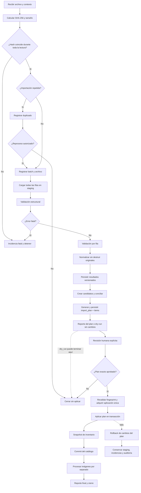

# Diseño del importador de Odoo

> **Arquitectura aprobada v0.1; implementación parcial con contrato de entrada v0.2 (2026-08-24)**

> Decisión de alcance vigente (2026-08-27): el catálogo sólo procesa identidad, referencias y
> compatibilidad. Las secciones históricas de inventario describen capacidad del esquema, pero el
> importador activo no normaliza moneda, precio, cantidades, UoM, responsable, etiquetas, favoritos,
> fechas operativas ni `Imagen 128`, y no crea snapshots de inventario.

El dry-run, staging, resultados, incidencias y planes ya tienen una implementación piloto. El
contrato `natsuki-empaques-v0.2` acepta columnas conocidas reordenadas, conserva columnas nuevas,
reporta opcionales ausentes y permite conteos variables bajo un límite de piloto de 5,000 filas.
La aprobación/apply empresarial, candidatos, medios procesados y cierre completo descritos más
adelante siguen pendientes. `docs/STATUS_AUDIT_V2_2.md` contiene el estado operativo vigente.

Este documento conserva el flujo objetivo v0.1 aprobado. No debe interpretarse como evidencia de
que cada etapa ya funciona: el estado se determina mediante código, pruebas e informe de auditoría.

## 1. Alcance

El importador propuesto recibe archivos Excel/CSV de Odoo, conserva toda la evidencia en
staging, valida, normaliza, concilia y presenta un dry-run antes de cualquier escritura en el
catálogo. La primera evidencia es la exportación `product.template` de NATSUKI / empaques:
893 filas, 13 columnas, 893 referencias internas únicas y 22 grupos de nombres duplicados.

Principios:

- Odoo sigue siendo la fuente maestra.
- El archivo se lee sin modificarlo.
- Toda fila entra en staging, incluso si contiene errores.
- El dato original nunca se sustituye por el normalizado.
- No se inventan variantes, IDs, aplicaciones ni imágenes.
- No se excluyen productos por stock cero/negativo o imagen ausente.
- No se fusiona por nombre.
- No se elimina ningún producto automáticamente.
- La presencia o ausencia no infiere el estado activo ni cambia la vigencia del catálogo.
- Todo cambio aplicado procede de un plan exacto, aprobado, transaccional, idempotente y auditable.

## 2. Entradas y salidas

### Entradas

- archivo `.xlsx`, `.csv` o `.tsv`;
- sistema fuente e instancia;
- alcance declarado: modelo, marca, familia y filtros;
- modo `dry_run` o `apply`;
- versión del perfilador y de las reglas;
- identidad de quien solicita y, cuando corresponda, aprueba.

### Salidas

- `import_batch` e `import_file` registrados;
- filas inmutables en `staging_row`;
- resultados versionados e inmutables en `staging_row_result`;
- incidencias en `import_issue`;
- candidatos de extracción/aplicación;
- `import_plan` e `import_plan_item` persistidos para todo modo, con archivo/fila coherentes;
- cambios normalizados, snapshots y eventos solo en modo aprobado;
- reporte JSON y Markdown con hash, métricas, decisiones y errores.

## 3. Estados de una importación

| Estado | Significado | Puede avanzar a |
|---|---|---|
| `received` | Solicitud y archivo recibidos | `hashing`, `cancelled` |
| `hashing` | Hash/tamaño en cálculo | `duplicate_detected`, `registered`, `failed` |
| `duplicate_detected` | Hash ya procesado o recibido | `cancelled`, `registered` con autorización de reproceso |
| `registered` | Batch y archivo registrados | `staging`, `failed` |
| `staging` | Filas originales en carga | `validating`, `failed` |
| `validating` | Validaciones estructurales y por fila | `normalizing`, `blocked`, `failed` |
| `normalizing` | Valores normalizados/candidatos | `reconciling`, `failed` |
| `reconciling` | Búsqueda de productos existentes | `planning`, `failed` |
| `planning` | Construcción y persistencia del plan exacto | `awaiting_review`, `blocked`, `failed` |
| `awaiting_review` | El plan espera revisión y decisión explícitas | `ready`, `dry_run_complete`, `cancelled`, `failed` |
| `ready` | Existe un plan explícitamente aprobado | `applying` |
| `dry_run_complete` | El plan fue entregado sin cambios empresariales; puede revisarse después | Estado final del batch |
| `applying` | Aplicación del plan aprobado en curso | `completed`, `completed_with_warnings`, `rolled_back`, `failed` |
| `completed` | Proceso terminado sin advertencias abiertas | Estado final |
| `completed_with_warnings` | Terminado con advertencias aceptadas | Estado final |
| `blocked` | Incidencia impide avanzar sin corrección/revisión | `validating`, `cancelled` |
| `rolled_back` | Escrituras normalizadas revertidas; staging conservado | `ready`, `cancelled` |
| `failed` | Fallo técnico no recuperado | `registered`, `staging`, `ready` según checkpoint |
| `cancelled` | Cancelación explícita y auditada | Estado final |

Las transiciones inválidas deben rechazarse y registrarse en `audit_event`.

### Estados de `import_plan`

| Estado | Significado | Transiciones permitidas |
|---|---|---|
| `generated` | Items y hash fueron persistidos | `awaiting_review`, `invalidated`, `failed` |
| `awaiting_review` | Espera decisión humana explícita | `approved`, `rejected`, `invalidated` |
| `approved` | Archivo, contrato, reglas y plan exactos fueron aprobados | `applying`, `invalidated` |
| `rejected` | Rechazo explícito | Final |
| `invalidated` | Cambió cualquier entrada o decisión que altera el plan | Final; generar plan sucesor |
| `applying` | Bloqueo atómico adquirido para una única aplicación | `applied`, `failed` |
| `applied` | Plan aplicado exactamente una vez | Final |
| `failed` | Generación o apply falló y quedó auditado | Final; generar plan sucesor si procede |

La falta de conflictos no permite saltar revisión ni aprobar automáticamente. La aprobación
corresponde al fingerprint de `file_sha256`, `contract_version`, `rules_version` y
`plan_sha256`; cualquier cambio invalida la aprobación.

## 4. Severidad de incidencias y reglas de avance

| Severidad | Ejemplo | Efecto por fila | Efecto por batch |
|---|---|---|---|
| `info` | Campo opcional vacío esperado | Continúa | Continúa |
| `warning` | Imagen ausente o fecha no convertible | Continúa sin ese dato normalizado | Puede terminar con advertencias |
| `error` | Referencia ausente, cantidad inválida o match ambiguo | Fila no se aplica automáticamente | Continúa staging; requiere revisión si afecta conciliación |
| `fatal` | Hash cambia durante lectura, XLSX corrupto o columnas críticas incompatibles | No aplica | Detiene antes del upsert |

Reglas:

1. Ninguna severidad evita conservar la evidencia que ya llegó a staging.
2. Un `fatal` abierto bloquea todo `apply`.
3. Un `error` de identidad bloquea esa fila y puede llevar el batch a `awaiting_review`.
4. Un error de imagen o fecha no debe bloquear los demás datos del producto.
5. Advertencias pueden aceptarse solo con actor, fecha y justificación.
6. El umbral de errores permitido debe formar parte de la configuración versionada.

## 5. Flujo completo



### 5.1 Recepción del archivo

- Validar extensión admitida, legibilidad, tamaño máximo configurable y contexto mínimo.
- No abrir con Excel ni guardar una versión nueva.
- Capturar nombre original, URI local controlada, usuario y alcance declarado.
- Confirmar que la marca/familia provienen del contexto de exportación si no son columnas.

### 5.2 Cálculo del hash

- Calcular SHA-256 por streaming antes de interpretar el contenido.
- Registrar tamaño y fecha de recepción.
- Recalcular al terminar la lectura; cualquier diferencia es `fatal`.

### 5.3 Detección de importaciones repetidas

- Buscar el hash en `import_file` para el mismo `source_system`.
- Registrar siempre el intento y enlazar `duplicate_of_file_id`.
- Por defecto no volver a aplicar un archivo ya completado con la misma versión de reglas.
- Permitir reproceso explícito para nuevas reglas, únicamente en dry-run hasta aprobación.

### 5.4 Registro de `import_batch` e `import_file`

- Crear registros en una transacción corta.
- Guardar alcance, modo, versiones, actores y hash.
- No incluir credenciales, Base64 ni datos sensibles en logs.

### 5.5 Lectura sin modificación

- Abrir el archivo en modo lectura/binario.
- Usar el perfilador existente como validación previa.
- Preservar encabezados, nombres de hoja, números de fila, seriales y valores originales.

### 5.6 Carga completa de staging

- Insertar todas las filas, incluidas las vacías/anómalas si el archivo las declara usadas.
- Crear `row_sha256` determinista sobre encabezados + valores originales canónicos.
- Escribir por lotes; cada lote confirmado es un checkpoint recuperable.
- `staging_row` guarda solamente archivo, hoja, fila, encabezados, valores, seriales,
  metadatos estructurales, hash y fecha de creación.
- Nunca corregir, normalizar, validar ni cambiar estados dentro de `staging_row`; es append-only.

### 5.7 Validación estructural

- Verificar hojas, encabezados, duplicados de encabezado y rango usado.
- Comparar contra un contrato versionado, no contra posiciones codificadas.
- Columnas desconocidas generan advertencia y se conservan.
- Ausencia de una columna crítica genera error/fatal según el modo.

### 5.8 Validación por fila

- Verificar tipos, nulos, longitudes, caracteres de control y coherencia numérica.
- Aceptar cantidades positivas, cero y negativas.
- No exigir imagen.
- Validar referencia como texto y preservar ceros/puntuación.
- Crear una incidencia por problema con fila y columna exactas.
- Persistir el resultado completado en `staging_row_result` con fila, archivo, batch, versiones de
  contrato/reglas, etapa, estado, datos normalizados, fechas y hash de resultado.
- Una reejecución o nueva versión crea otro resultado; jamás actualiza el anterior.

### 5.9 Normalización

- Generar valores normalizados fuera de staging y persistirlos en un nuevo `staging_row_result`.
- Aplicar reglas versionadas y deterministas.
- Mantener original, normalizado, regla, versión y confianza.
- No transformar una inferencia en dato aprobado sin revisión.

### 5.10 Conciliación

Orden de comparación propuesto:

1. ID estable de Odoo + sistema fuente, cuando exista.
2. ID externo + sistema fuente, cuando exista.
3. Provisionalmente: sistema fuente + marca + referencia interna normalizada.
4. Señales auxiliares para revisión: categoría, nombre y unidad; nunca como identidad autónoma.

Resultados posibles: `new`, `exact_match`, `possible_match`, `ambiguous`, `conflict`, `blocked`.

### 5.11 Detección de conflictos

- Varias plantillas para la misma clave provisional.
- Una plantilla con otra referencia primaria incompatible.
- Cambio de marca, categoría o unidad no explicado.
- ID Odoo que apunta a UUID distinto del match por referencia.
- Variante exportada sin plantilla estable conocida.

Los conflictos se registran; no se resuelven por “último archivo gana”.

### 5.12 Generación y persistencia del plan

Todo modo, incluido `apply`, genera primero un `import_plan` y sus `import_plan_item`, sin
modificar el catálogo. Cada item usa uno de estos tipos de operación:

- `create`, `update`, `no_change`, `conflict`, `blocked`;
- `inventory_snapshot`, `media_pending`, `extraction_candidate`.

El plan conserva:

- altas propuestas;
- actualizaciones campo por campo;
- coincidencias exactas y ambiguas;
- filas bloqueadas;
- snapshots que se crearían;
- medios que entrarían a cola;
- incidencias por severidad;
- `before_values`, `proposed_values`, incidencias, necesidad de revisión y decisión humana;
- `item_sha256` por operación y `plan_sha256` sobre la serialización canónica completa;
- hash del archivo, versión del contrato y versión de reglas.

Cada item repite `import_file_id` deliberadamente. Una FK compuesta lo liga al archivo del plan y
otra liga su `staging_row_id` al mismo archivo; no puede construirse un item con evidencia
procedente de otro archivo.

La generación termina en `awaiting_review`. El modo `dry_run` entrega este plan para revisión y
no escribe datos empresariales. El modo solicitado no altera el contenido del plan.

### 5.13 Revisión humana

- Mostrar evidencia original y propuestas lado a lado.
- Registrar aprobar/rechazar/crear nuevo/enlazar existente sin editar un plan generado.
- Exigir comentario en conflictos y coincidencias ambiguas.
- Una resolución humana genera un plan sucesor con items y hashes nuevos e invalida el anterior.
- Aprobar explícitamente el fingerprint de archivo + contrato + reglas + plan completo.
- La ausencia de conflictos no aprueba ni inicia apply automáticamente.

### 5.14 Aprobación exacta y apply transaccional

- Aceptar exclusivamente un `import_plan` en estado `approved`.
- Recalcular el hash del archivo y el fingerprint de archivo, contrato, reglas y plan.
- Cambiar atómicamente `approved -> applying`; si no se adquiere ese estado, detener.
- Rechazar planes ya `applied` para impedir una segunda aplicación.
- Bloquear únicamente productos afectados.
- Insertar/actualizar por UUID interno y match aprobado.
- Generar `audit_event` por cada cambio con el `import_plan_id` aplicado.
- Registrar el mismo `import_plan_id` en snapshots y cierre del proceso.
- No alterar `source_active` ni `catalog_status` por ausencia en la exportación.
- Marcar el plan `applied` solo tras commit; un fallo revierte el apply y queda auditado.

### 5.15 Snapshot de inventario

- Crear una fila append-only por producto/fila aplicada.
- Conservar cantidad real, disponible, unidad, batch, archivo, plan, item aplicado, fila y fecha de procedencia.
- Enlazar el `import_plan_item` exacto mediante el mismo plan, archivo, fila, plantilla y objetivo
  de producto; el objetivo generado distingue plantilla de variante.
- No sobrescribir el snapshot anterior.
- Permitir un único snapshot por `import_plan_item_id` para que un reintento no lo duplique.
- No omitir valores cero o negativos.

### 5.16 Procesamiento independiente de imágenes

- Ejecutar después del commit normalizado, en una cola/reintento separado.
- Clasificar `presente`, `ausente`, `error_de_exportacion`, `invalida` o `procesada`.
- Validar Base64 y firma de archivo antes de decodificar.
- Calcular SHA-256 del contenido y deduplicar por hash.
- Almacenar físicamente por hash en un backend configurable, inicialmente filesystem.
- Guardar URI, hash, tipo, tamaño, estado y metadatos en `media_asset`, no Base64 en el producto.
- Una imagen inválida nunca revierte el producto.
- Nunca modificar ni eliminar imágenes originales de Odoo.

### 5.17 Generación del reporte

Generar JSON y Markdown con:

- IDs, hash, alcance, modo y versiones;
- timestamps/duración por etapa;
- conteos leídos, staged, válidos, bloqueados, nuevos y actualizados;
- matches, conflictos y decisiones humanas;
- incidencias por código/severidad;
- snapshots y medios creados/pendientes;
- ID/estado/fingerprint del plan exacto y resultado del commit/rollback;
- rutas de reportes sin incluir datos sensibles en logs de consola.

### 5.18 Cierre o rollback

- Si falla antes del apply, conservar staging y marcar checkpoint.
- Si falla el apply, revertir toda la transacción de catálogo/snapshots del batch.
- Nunca revertir el registro del batch, staging, incidencias o auditoría.
- Imágenes tienen compensación/reintento independiente.
- Cerrar solo después de reconciliar métricas y registrar estado final.

## 6. Matriz de las 13 columnas reales

La matriz contiene únicamente columnas presentes en la exportación. Marca y familia son
contexto declarado del batch, no columnas inventadas.

| Columna exacta de origen | Tipo observado | Destino propuesto | Transformación | Validaciones | ¿Nulo aceptado? | Comportamiento ante error | ¿Conciliación? |
|---|---|---|---|---|---|---|---|
| Moneda | texto | `product_template.currency_code` | Trim conservando original; mapear a código validado sin reemplazar raw | Texto, longitud y código conocido | Sí en normalizado; no ocurrió en muestra | Warning; conservar raw y dejar normalizado nulo | No |
| Estado de la actividad | vacío en 893 filas | `product_template.activity_state`; nunca `source_active` | Ninguna si está vacío; conservarlo como concepto distinto de `Activo` | Si aparece, tratar como texto de actividad y registrar valor nuevo | Sí | Info/Warning si aparece valor no contemplado; no bloquear ni inferir vigencia | No |
| Categoría de producto | texto | `product_category.source_path` + FK de `product_template` | Conservar ruta; segmentar/normalizar por regla versionada | No vacío en muestra; jerarquía sin ciclos | No para apply automático | Error de fila; staging continúa y producto queda bloqueado | No; solo señal auxiliar |
| Favorito | booleano | `product_template.is_favorite` | Conversión estricta de booleano | Solo booleano o representación aprobada | Sí en normalizado | Warning y valor normalizado nulo | No |
| Nombre | texto | `product_template.name_original`; candidatos en `extraction_candidate` | Conservar íntegro; normalización separada; extraer candidatos | No vacío, límites, caracteres de control | No para producto aplicable | Error de fila si vacío; nunca usar para fusionar | No |
| Referencia interna | texto | `product_reference.value_original/value_normalized` | Normalización versionada sin perder ceros, guiones, espacios significativos ni puntuación | No vacío para conciliación; longitud; ambigüedad contextual | No para match automático; sí en staging | Error y revisión humana; no inventar referencia | Sí, provisionalmente con sistema fuente + marca |
| # Variantes de producto | entero | `product_template.variant_count_observed` | Conversión a entero no negativo | Entero >= 0 | Sí en normalizado si falla | Error/Warning; conservar raw y no crear variantes | No |
| Cantidad real | entero observado | `inventory_snapshot.quantity_on_hand` | Conversión a `numeric`, conservar signo | Numérico; positivos, cero y negativos válidos | Sí para producto; no para snapshot completo | Error del snapshot; producto puede continuar | No |
| Unidad de medida | texto | `product_template.uom_original` e `inventory_snapshot.uom_original` | Trim y lookup opcional, conservando texto | Texto no vacío en muestra | Sí en normalizado | Warning; conservar original y evitar conversión de unidades | No |
| Cantidad disponible | entero observado | `inventory_snapshot.quantity_available` | Conversión a `numeric`, conservar signo | Numérico; positivos, cero y negativos válidos | Sí para producto; no para snapshot completo | Error del snapshot; producto puede continuar | No |
| Imagen 128 | texto o vacío | raw en `staging_row`; estado/URI/hash en `media_asset` y vínculo en `product_media` | Clasificar; validar Base64/formato; decodificar asincrónicamente | Vacío permitido; firma/tamaño/tipo antes de procesar | Sí | Warning; estado `ausente/error_de_exportacion/invalida`; nunca bloquear producto | No |
| Última actualización el | serial decimal Excel | raw en `staging_row.raw_excel_serials`; `product_template.source_updated_at` | Convertir con sistema 1900/1904 y zona fuente confirmados | Rango plausible; conversión reversible; zona declarada | Sí en normalizado | Warning; conservar serial y dejar fecha nula | No |
| Mostrar botón de estado de cantidad real | booleano | `product_template.show_quantity_status` | Conversión estricta de booleano | Solo booleano o representación aprobada | Sí en normalizado | Warning y valor normalizado nulo | No |

La exportación actual no contiene el booleano `Activo` de Odoo. Por ello `source_active` queda
`NULL`, que significa “estado de Odoo desconocido porque el campo no fue proporcionado”. El
campo interno `catalog_status` es separado y admite `pending_review`, `active`, `inactive` y
`archived`; una alta propuesta comienza en `pending_review`, no en `active`. Ni la presencia
actual ni la ausencia futura modifican automáticamente ambos estados. Desactivar o archivar
requiere una decisión explícita incluida en un plan aprobado y su auditoría.

## 7. Datos derivados de `Nombre`

Marca de vehículo, modelo, motor, cilindrada, años, posición/lado, material, medidas y
observaciones se guardan como candidatos. Cada candidato incluye:

- `evidence_original` y posición dentro del texto;
- `value_original` y `value_normalized`;
- `rule_code` y `rule_version`;
- `confidence` entre 0 y 1;
- `review_status` (`pending`, `approved`, `rejected`);
- `staging_row_id`, producto opcional, actor, fecha y nota de revisión.

`pending` no porta actor ni fecha de una decisión. `approved` o `rejected` exige un actor humano
no vacío y una fecha no anterior a la creación. La base valida la presencia y coherencia de esa
evidencia; autorización, identidad real del usuario y auditoría del cambio siguen en la aplicación.

Las FKs compuestas rechazan una combinación marca/modelo o marca/modelo/motor incompatible cuando
esos IDs estructurados están presentes. Un motor sin modelo puede conservarse como candidato
general, y una combinación incompleta o ambigua debe permanecer `pending` hasta revisión humana.

Una regla nueva crea nuevos candidatos; no reescribe los anteriores. Los aprobados pueden
alimentar entidades vehiculares, pero la evidencia y decisión permanecen auditables.
La estrategia aprobada es híbrida: reglas deterministas y versionadas proponen candidatos con
confianza; toda ambigüedad exige revisión humana. Las reglas empresariales concretas continúan
pendientes de ejemplos y validación externa.

## 8. Idempotencia

- **Archivo:** SHA-256 + sistema fuente detectan recepciones repetidas.
- **Staging:** unique `(import_file_id, sheet_name, source_row_number)` y hash de fila.
- **Resultados:** fila + batch + contrato + reglas + etapa + intento identifican resultados
  append-only; reejecutar nunca los sobrescribe.
- **Conciliación:** usa IDs estables cuando existan o clave provisional contextual.
- **Plan:** items y plan completo tienen hashes canónicos; todo cambio crea un plan sucesor.
- **Apply:** la transición atómica `approved -> applying` impide aplicar dos veces el mismo plan.
- **Inventario:** unique por `import_plan_item_id` evita duplicar el snapshot exacto en reintentos.
- **Auditoría:** `correlation_id` y hash de evento permiten detectar repeticiones.

Un mismo archivo con una nueva versión de reglas puede reprocesarse para comparar resultados,
pero crea resultados y plan nuevos; no puede aplicar cambios hasta aprobar exactamente ese plan.

## 9. Límites de transacción

1. **Registro:** transacción corta para batch/archivo.
2. **Staging:** lotes configurables, cada uno con checkpoint; no mezcla productos normalizados.
3. **Validación/extracción:** resultados durables por etapa y versión.
4. **Apply:** para el volumen actual, una transacción atómica por plan aprobado que incluya
   productos, referencias, candidatos aprobados, snapshots y auditoría.
5. **Medios:** transacciones independientes por recurso después del commit del producto.
6. **Reporte/cierre:** transacción corta que reconcilia métricas y estado.

Para volúmenes futuros mayores se evaluará partición por marca/familia, sin sacrificar la
capacidad de identificar exactamente qué subconjunto fue confirmado o revertido.

## 10. Recuperación y reintentos

| Falla | Recuperación | Reintento |
|---|---|---|
| Lectura/hash | Marcar `failed`, no aplicar | Manual tras verificar archivo |
| Staging por lote | Reanudar desde último checkpoint | Automático idempotente |
| Validación determinista | Corregir contrato/regla, crear versión nueva | Manual/versionado |
| Conexión PostgreSQL transitoria | Mantener estado previo y correlation ID | Máximo 3 con backoff |
| Deadlock/serialización en apply | Rollback total del apply | Nuevo intento controlado solo si conserva exactamente plan/fingerprint y el plan no quedó aplicado |
| Conflicto de conciliación | `awaiting_review` | Tras decisión humana |
| Imagen inválida | Producto permanece confirmado | Reintento solo si fue falla transitoria |
| Escritura de reporte | Batch queda aplicado pero “cierre pendiente” | Regenerar desde DB/auditoría |

No se reintentan automáticamente errores de datos. Cada reintento conserva el mismo
`correlation_id` y añade eventos, sin borrar el intento anterior.

## 11. Auditoría y seguridad operacional

Registrar como mínimo:

- recepción, hash, duplicado y cambio de estado;
- versiones de contrato, perfilador y reglas;
- actor que solicita, revisa y aprueba;
- plan, items, fingerprint aprobado e `import_plan_id` efectivamente aplicado;
- match seleccionado y alternativas descartadas;
- before/after de cada upsert;
- snapshot de inventario creado;
- estado de medio y hash de contenido;
- rollback, reintentos y resoluciones de incidencias.

Los logs operativos no deben contener Base64, credenciales ni filas completas. La evidencia
empresarial vive en staging protegido y los reportes locales permanecen ignorados por Git.

## 12. Métricas

- bytes y tiempo de hash/lectura;
- hojas, filas físicas, filas staged y columnas;
- filas válidas, con warning, error, fatal y bloqueadas;
- altas, actualizaciones, sin cambio, matches ambiguos y conflictos;
- candidatos por tipo/confianza/estado;
- snapshots creados y distribución de cantidades sin exponer referencias;
- medios presentes, ausentes, inválidos, con error y procesados;
- duración por etapa, reintentos y rollback;
- diferencias entre conteos de entrada, staging, plan y commit.

Cada reporte debe reconciliar: `filas leídas = filas staged = filas clasificadas`.

## 13. Pseudocódigo

```text
function generate_import_plan(file, context, requested_mode, contract_version, rules_version):
    assert requested_mode in {dry_run, apply}
    initial_hash = sha256_stream(file)
    batch = register_received_attempt(context, requested_mode, contract_version, rules_version)

    previous = find_previous_file(context.source_system, initial_hash)
    if previous and not context.reprocess_authorized:
        mark_duplicate(batch, previous)
        return duplicate_report(batch)

    import_file = register_file(batch, file.metadata, initial_hash)
    rows = read_without_modifying(file)

    for chunk in chunks(rows):
        insert_staging_idempotently(import_file, chunk)

    assert sha256_stream(file) == initial_hash
    validation_results = validate_to_new_results(
        import_file, batch, contract_version, rules_version
    )
    record_issues(validation_results)

    normalized_results = normalize_to_new_results(
        validation_results, batch, contract_version, rules_version
    )
    candidates = extract_candidates(normalized_results, rules_version)
    reconciliation = reconcile(
        normalized_results,
        by=[odoo_id, external_id, source_system + brand + internal_reference],
    )

    items = build_plan_items(
        normalized_results, candidates, reconciliation, validation_results
    )
    plan = persist_immutable_plan(
        batch=batch,
        import_file=import_file,
        file_sha256=initial_hash,
        contract_version=contract_version,
        rules_version=rules_version,
        items=items,
        plan_sha256=canonical_plan_sha256(items),
        status=generated,
    )
    transition_plan(plan, from=generated, to=awaiting_review)
    return review_package(plan)  # dry_run termina aquí; apply también espera aprobación

function record_human_resolution(plan_id, decisions, actor):
    original_plan = load_plan(plan_id)
    assert original_plan.status == awaiting_review
    successor_items = apply_decisions_without_mutating_original(original_plan.items, decisions)
    successor_plan = persist_successor_plan(original_plan, successor_items)
    invalidate(original_plan, reason="human_decision_changed_plan")
    return review_package(successor_plan)

function approve_plan(plan_id, actor):
    plan = load_plan_with_items(plan_id)
    assert plan.status == awaiting_review
    assert canonical_plan_sha256(plan.items) == plan.plan_sha256
    fingerprint = sha256_canonical(
        plan.file_sha256,
        plan.contract_version,
        plan.rules_version,
        plan.plan_sha256,
    )
    persist_explicit_approval(plan, fingerprint, actor)
    return plan.import_plan_id

function apply_approved_plan(plan_id, actor):
    plan = load_plan_with_items(plan_id)
    assert plan.status == approved
    assert sha256_stream(plan.import_file.storage_uri) == plan.file_sha256
    assert current_contract_version == plan.contract_version
    assert current_rules_version == plan.rules_version
    assert canonical_plan_sha256(plan.items) == plan.plan_sha256
    assert approval_fingerprint_matches(plan)

    acquired = compare_and_set_status(plan, from=approved, to=applying)
    assert acquired  # evita concurrencia, reapply y aprobación implícita

    try:
        begin transaction:
            upsert_approved_products(plan)
            append_inventory_snapshots(plan, import_plan_id=plan_id)
            append_audit_events(plan, import_plan_id=plan_id)
            mark_plan_applied(plan, actor)
        commit transaction
    catch error:
        rollback transaction
        mark_plan_failed_and_audit(plan, error, import_plan_id=plan_id)
        raise

    enqueue_media_processing(plan.media)
    reconcile_metrics(plan.import_batch_id)
    return final_report(plan.import_batch_id, plan_id)
```

## 14. Decisiones aprobadas para v0.1

- UUID interno estable; IDs Odoo solo como identificadores contextuales, nunca como PK interna.
- Referencias duplicadas permitidas, sin fusión automática y con resolución humana contextual.
- Imágenes físicas por hash, backend configurable (filesystem primero) y metadatos/URI en PostgreSQL.
- Staging y resultados inmutables; staging retenido indefinidamente durante las fases iniciales.
- Releases inmutables `draft/published/archived`, con snapshot JSON exacto y versionado.
- XML de InDesign generado por adaptador; JSON es la fuente canónica interna.
- Snapshot de inventario en cada importación, sin sobrescribir historia.
- Timestamps normalizados a UTC conservando valor/zona originales; conversión definitiva aplazada.
- Extracción vehicular híbrida con reglas deterministas/versionadas, confianza y revisión humana.
- Todo modo genera un plan; apply exige aprobación exacta y solo puede ejecutarlo una vez.
- `source_active` nullable y `catalog_status` separado; toda baja/archivo es explícita y auditada.

## 15. Información externa todavía pendiente

- IDs estables reales de Odoo.
- Zona horaria configurada en Odoo.
- Sistema de fechas 1900/1904 del Excel.
- Directorio inicial concreto de imágenes.
- Política futura de archivado cuando existan métricas reales de volumen.
- Reglas empresariales específicas para aplicaciones vehiculares.

La arquitectura v0.1 está aprobada documentalmente y no implementada. El DDL v0.2 corregido debe
recibir una segunda revisión manual antes de instalar PostgreSQL o ejecutar una migración.
